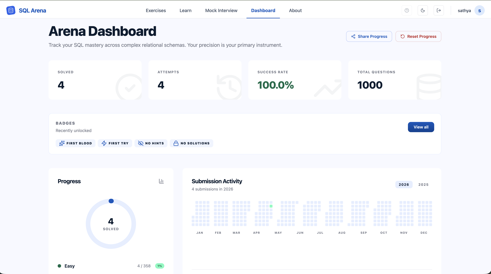
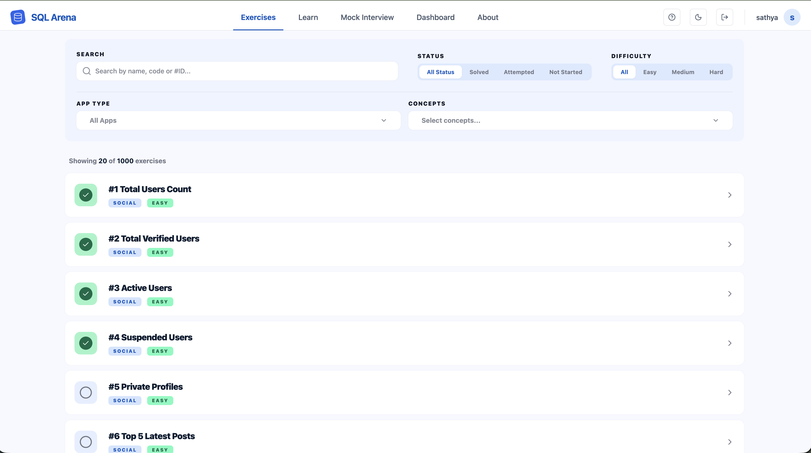
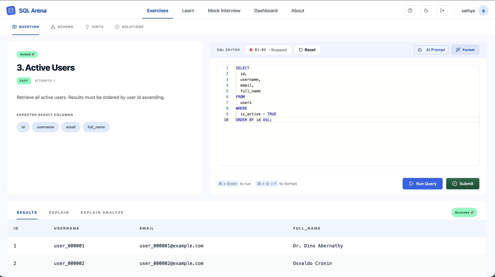
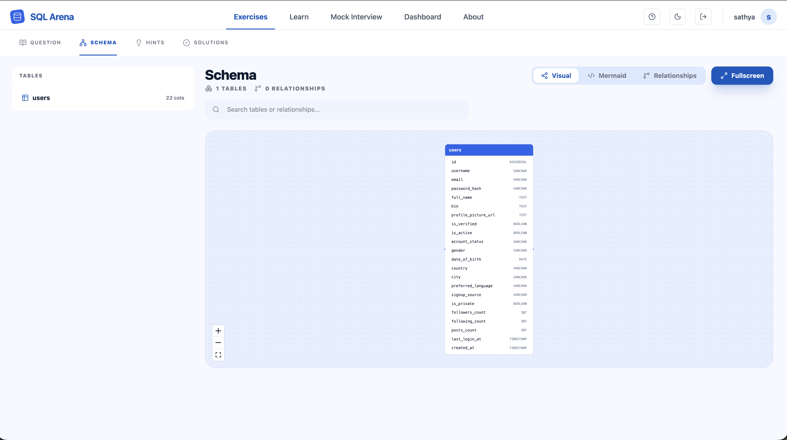
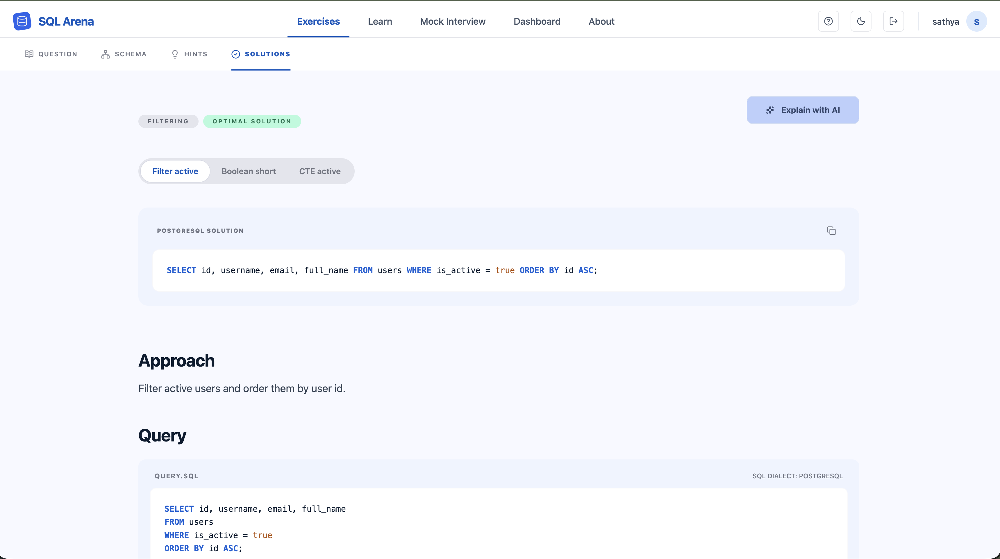
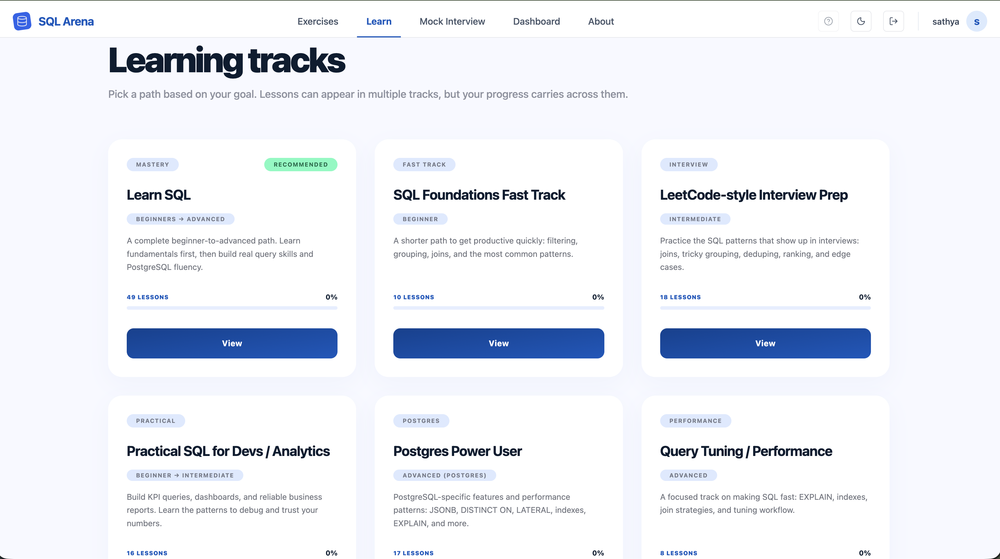
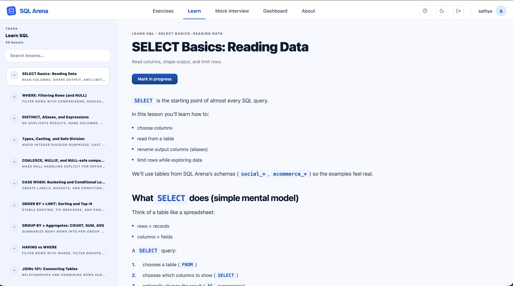
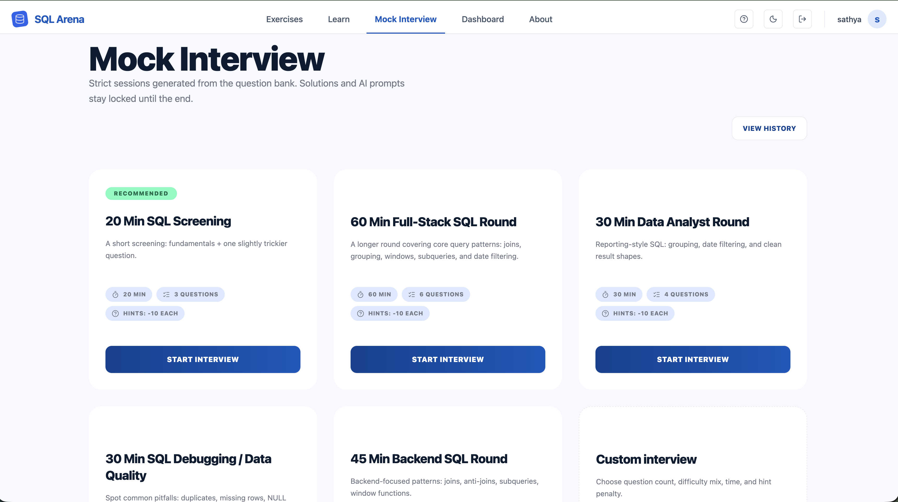

# SQL Arena — Screens & Features

This doc is a quick visual tour of the app. Each section shows a real screenshot from `images/` and lists the key functionality on that screen.

## Dashboard

- Progress overview: solved count, attempts, success rate, total questions
- Submission activity heatmap (year switch)
- Latest accomplishments table + pagination
- Badges entry point + sharing progress
- Reset progress action

## Exercises — List

- Search by name/code/id
- Filters: status, difficulty, app(s), concepts
- Exercise cards with status/difficulty badges
- Pagination

## Exercise — Question (Editor + Results)

- Sub-tabs: Question / Schema / Hints / Solutions
- Question details + expected output headers
- SQL editor with format/run/submit actions
- Results panel with tabs: Results / Explain / Explain Analyze
- Server-persisted timer (start/pause/resume/stop/reset; auto-pause on leave; auto-stop on solve)

## Exercise — Schema

- Schema Explorer: table list + search
- Views: Visual / Mermaid / Relationships
- Fullscreen mode for schema exploration

## Exercise — Solutions

- Unlock flow (or auto-available after solve)
- Multiple solution approaches (approach tabs)
- Highlighted SQL solution with copy action
- Markdown explanation using the V2 renderer
- “Explain with AI” prompt action

## Learn — Tracks

- Track catalog with progress indicators
- Track cards + navigation into a track

## Learn — Lesson Viewer

- Fixed lesson sidebar navigation (scrollable)
- Lesson content area with the V2 markdown renderer
- Lesson progress actions (mark in progress / mark completed)

## Mock Interviews

- Template-based mock interviews (time + question count + rules)
- Resume active session and session history entry point
- Custom template creation (difficulty flow, apps, time, hint penalty)

