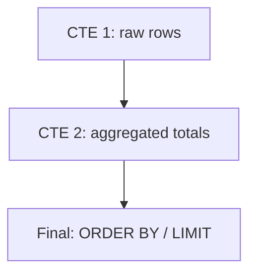

CTE stands for **Common Table Expression**.

A CTE lets you name an intermediate result and use it like a temporary table inside one query.

---

## Why CTEs are useful

- Make complex queries readable (step-by-step)
- Avoid repeating the same subquery multiple times
- Make it harder to accidentally change logic when refactoring

---

## The basic shape

```sql
WITH some_name AS (
  SELECT ...
)
SELECT ...
FROM some_name;
```

You can chain multiple CTEs:

```sql
WITH a AS (...),
     b AS (...)
SELECT ...
FROM b;
```

---

## Example: average comments per commented post

CTE version:

```sql
WITH post_comment_counts AS (
  SELECT post_id, COUNT(*) AS comment_count
  FROM social_comments
  GROUP BY post_id
)
SELECT ROUND(AVG(comment_count), 2) AS avg_comments
FROM post_comment_counts;
```

Subquery version (same result):

```sql
SELECT ROUND(AVG(comment_count), 2) AS avg_comments
FROM (
  SELECT post_id, COUNT(*) AS comment_count
  FROM social_comments
  GROUP BY post_id
) t;
```

Use the style your team finds most readable.

---

## Example: “Top 5 users by total interactions”

```sql
WITH interaction_rows AS (
  SELECT user_id FROM social_likes
  UNION ALL
  SELECT user_id FROM social_comments
),
interaction_totals AS (
  SELECT user_id, COUNT(*) AS interactions
  FROM interaction_rows
  GROUP BY user_id
)
SELECT user_id, interactions
FROM interaction_totals
ORDER BY interactions DESC, user_id ASC
LIMIT 5;
```

Why this is nice:

- `interaction_rows` clearly defines “what is an interaction”
- `interaction_totals` clearly defines “how we count them”
- The final query is only ranking/limiting

---

## CTEs and performance (practical note)

In modern PostgreSQL, CTEs are usually inlined into the main query plan unless you force materialization.

That means:

- Most of the time, a CTE is a readability tool (not a performance tool)
- You should still check `EXPLAIN` when performance matters

---

## Diagram: staged query construction



---

## Check yourself

1) Rewrite “Top 5 most followed verified users” as a two-CTE query:
   - CTE 1: follower counts per followee
   - CTE 2 (optional): verified users
2) Create a CTE that finds today’s posts, then count today’s comments per post.
