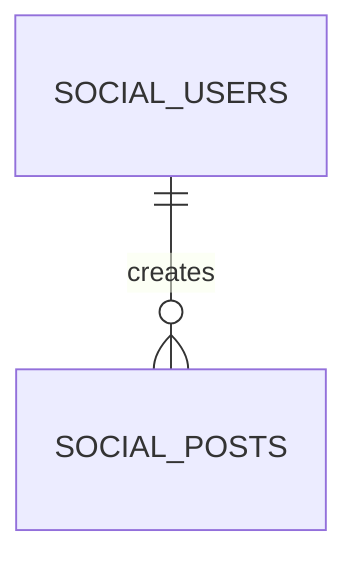
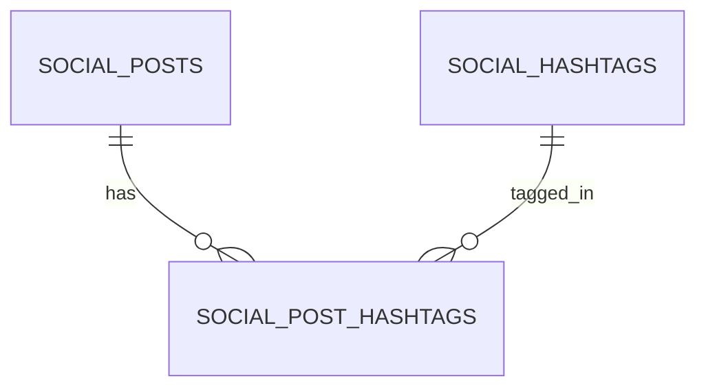
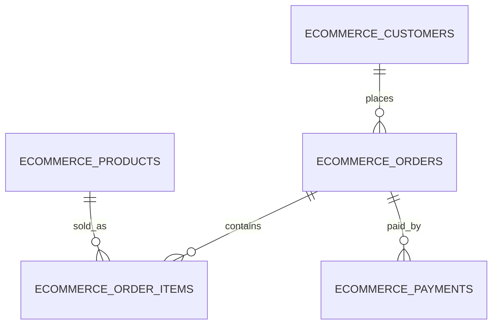
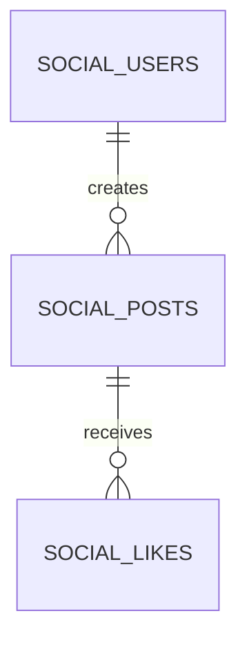

If SQL sometimes feels “hard”, it’s often because the **data is split across tables**.

That split is not a mistake. It’s the result of **data modeling**:

- deciding what tables exist
- deciding how they relate
- deciding where each piece of information belongs

Once you learn to *see* a schema as entities and relationships, queries become much easier to reason about.

This lesson uses the two schemas in this project:

- **social**: users, posts, likes, comments, follows, hashtags
- **ecommerce**: customers, orders, order_items, payments, products, categories

---

## What you’re modeling: entities and relationships

### Entities (“things”)

An entity table stores the attributes of a thing:

- `social_users` (a person/user)
- `social_posts` (a post)
- `ecommerce_customers` (a customer)
- `ecommerce_products` (a product)

Entity tables usually have:

- a primary key (`id`)
- descriptive columns (name, title, created_at, etc.)

### Relationships (“links between things”)

Relationships tell you how entities connect:

- a user creates many posts
- a post has many likes
- an order contains many products (via order_items)

Relationships are represented using:

- **foreign keys** (one-to-many)
- **mapping tables** (many-to-many)

---

## The 3 most common relationship types

### 1) One-to-many (1:N)

Example: one user → many posts.



Implementation pattern:

- child table (`social_posts`) stores `user_id` that references `social_users(id)`

Query implication:

- joining posts to users is straightforward

```sql
SELECT p.id AS post_id, u.id AS user_id, u.username
FROM social_posts p
JOIN social_users u ON u.id = p.user_id
ORDER BY p.id ASC
LIMIT 10;
```

---

### 2) Many-to-many (N:M)

Example: posts ↔ hashtags.



Implementation pattern:

- mapping table: `social_post_hashtags(post_id, hashtag_id)`
- each row means “this post has this hashtag”

Query implication:

- you usually join through the mapping table

```sql
SELECT ph.post_id, ph.hashtag_id
FROM social_post_hashtags ph
ORDER BY ph.post_id ASC
LIMIT 10;
```

---

### 3) One-to-one (1:1) (less common)

Sometimes two tables have a 1:1 relationship, often for optional/rare fields.

Example (conceptual): user profile settings might be separate from users.

You’ll usually implement it with:

- a table that has a unique foreign key to the parent table

Most of the time, you can keep 1:1 fields in the same table unless the optional fields are large or rarely accessed.

---

## Normalization (the “don’t duplicate facts” rule)

Normalization is a fancy word for a practical rule:

> Store a fact in exactly one place.

Why?

If you duplicate facts across tables, you create update problems:

- Which copy is correct?
- What happens when they disagree?

### Example: customer info in orders (what *not* to do)

Imagine storing `customer_email` on every order row.

If the customer changes their email, you would need to update every order row.

Better model:

- store customer attributes in `ecommerce_customers`
- store the relationship in `ecommerce_orders.customer_id`

Then a query can join orders to customer data when needed.

---

## A practical e-commerce model (and why it looks like this)

Here’s the standard pattern:



Why `order_items` exists:

- an order can contain many products
- each product can appear in many orders
- the relationship needs extra attributes:
  - `quantity`
  - `unit_price`

Those attributes belong to the relationship, not the product and not the order.

---

## “Where should this column live?” (beginner checklist)

When you’re unsure where a column belongs, ask:

1) Does this attribute describe one entity, or a relationship?
2) Does it change independently of other entities?
3) Would duplicating it create inconsistency later?

Examples:

- `ecommerce_orders.order_date` describes the order → `ecommerce_orders`
- `ecommerce_customers.first_name` describes the customer → `ecommerce_customers`
- `ecommerce_order_items.quantity` describes the order↔product relationship → `ecommerce_order_items`

---

## Common query shapes that come from modeling

### Shape A: “entity metric” (single table)

Example: “Top 5 days by post volume” uses only `social_posts`.

```sql
SELECT DATE(created_at) AS day, COUNT(*) AS post_count
FROM social_posts
GROUP BY DATE(created_at)
ORDER BY post_count DESC, day ASC
LIMIT 5;
```

### Shape B: “relationship metric” (join + aggregate)

Example: “Top 5 verified users by followers”.

Conceptually:

- users are the entity
- follows are a relationship (many rows per followee)

```sql
SELECT u.id, COUNT(*) AS follower_count
FROM social_users u
JOIN social_follows f ON f.followee_id = u.id
WHERE u.is_verified = true
GROUP BY u.id
ORDER BY follower_count DESC, u.id ASC
LIMIT 5;
```

### Shape C: “pre-aggregate then join” (avoid multiplying rows)

Example: average likes received per liked post for each user.

If you try to join raw likes directly to users, you can end up counting the wrong thing or doing too much work.

Better pattern:

1) aggregate likes per post
2) join that to posts (to get user_id)
3) aggregate again per user

```sql
SELECT p.user_id, ROUND(AVG(l.like_count), 2) AS avg_likes
FROM (
  SELECT post_id, COUNT(*) AS like_count
  FROM social_likes
  GROUP BY post_id
) l
JOIN social_posts p ON p.id = l.post_id
GROUP BY p.user_id
ORDER BY p.user_id ASC;
```

---

## Practical diagrams you should be able to “read”

When you see an ER diagram like:



You should immediately infer:

- `social_posts.user_id` exists
- `social_likes.post_id` exists
- many likes can exist for one post

That mental translation is what makes SQL feel intuitive.

---

## Common mistakes (and how to avoid them)

### Mistake 1: storing lists in a single column

Example: storing `hashtag_ids` as a comma-separated string inside posts.

That breaks:

- referential integrity (no foreign keys)
- querying (hard to join/filter)
- indexing

Use a mapping table instead.

### Mistake 2: using one big “events” table for everything

It can look simpler, but it makes constraints and joins harder, and can lead to a lot of nullable columns.

Split tables by responsibility, then join them in queries.

### Mistake 3: forgetting relationship attributes

If a relationship has attributes (`quantity`, `unit_price`), it usually needs its own table.

---

## Practice: check yourself

1) Why is `ecommerce_order_items` a separate table instead of columns like `product_1_id`, `product_2_id`, ...?
2) In a many-to-many relationship, why do we use a mapping table?
3) Which table should store user bio: `social_users` or `social_posts`? Why?
4) In one sentence: what does normalization prevent?

---

## Summary

- Schemas model **entities** and **relationships**.
- One-to-many uses foreign keys; many-to-many uses mapping tables.
- Normalization avoids duplicated facts and inconsistent updates.
- The schema shape strongly predicts the query shape: single-table metrics, joins, or pre-aggregate-then-join.
