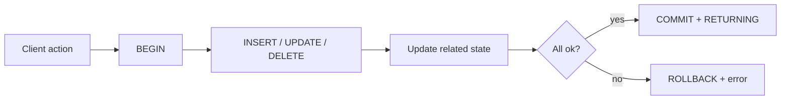

So far, most lessons focused on reading data (`SELECT`).

Real applications also **change** data:

- create users
- record submissions
- update progress
- delete/reset data

Statements that modify data are called **DML** (Data Manipulation Language):

- `INSERT` — add rows
- `UPDATE` — modify rows
- `DELETE` — remove rows

PostgreSQL also supports a very practical feature:

- `RETURNING` — return the rows you changed (super useful for APIs)

This lesson focuses on safe, beginner-friendly patterns using SQL Arena tables.

---

## Why it matters

DML is where bugs can become serious:

- one missing `WHERE` can update every row
- a “half-failed” multi-step write can corrupt state (submission inserted but progress not updated)
- concurrency can produce duplicates unless constraints and transactions are used correctly

The goal is to learn a few patterns you can rely on.

---

## 1) `INSERT`: create rows

### Insert one row

```sql
INSERT INTO users (username)
VALUES ('test');
```

If the table has defaults (like `created_at DEFAULT NOW()`), you can omit them.

### Insert multiple rows

```sql
INSERT INTO concepts (name)
VALUES ('joins'), ('aggregation'), ('window_functions');
```

### Insert from a `SELECT` (very common)

You can insert rows produced by a query.

Example: create lesson progress for a user for one lesson (conceptual):

```sql
INSERT INTO user_lesson_progress (user_id, lesson_id, status, updated_at)
SELECT 1, id, 'not_started', NOW()
FROM lessons
WHERE slug = 'select-basics';
```

This pattern becomes powerful when you want to create many rows at once.

---

## 2) `RETURNING`: get inserted/updated/deleted rows

In PostgreSQL, `RETURNING` saves round-trips in APIs.

### Insert and return the generated id

```sql
INSERT INTO users (username)
VALUES ('bob')
RETURNING id, username, created_at;
```

Output shape:

| id | username | created_at |
|---:|---|---|
| 17 | bob | 2026-04-01 12:34:56 |

This avoids the “insert then select” pattern.

### `RETURNING` with updates/deletes

You can also return updated/deleted rows (shown below).

---

## 3) `UPDATE`: change rows safely

### Update one row with a precise filter

Example: mark a user’s progress for a question as attempted.

```sql
UPDATE user_progress
SET status = 'attempted',
    updated_at = NOW()
WHERE user_id = 1 AND question_id = 123;
```

### Update and return the updated row

```sql
UPDATE user_progress
SET status = 'solved',
    solved_at = NOW(),
    updated_at = NOW()
WHERE user_id = 1 AND question_id = 123
RETURNING user_id, question_id, status, solved_at;
```

Output shape:

| user_id | question_id | status | solved_at |
|---:|---:|---|---|
| 1 | 123 | solved | 2026-04-01 12:40:00 |

### Update using a calculated value (incrementing counters)

```sql
UPDATE user_progress
SET attempts_count = attempts_count + 1,
    updated_at = NOW()
WHERE user_id = 1 AND question_id = 123;
```

---

## 4) The most dangerous DML bug: missing `WHERE`

This updates every row:

```sql
UPDATE user_progress
SET status = 'solved';
```

Beginner habit:

- write the `WHERE` first
- then fill in the `SET`
- and always run a `SELECT` with the same `WHERE` to confirm the target rows

```sql
SELECT *
FROM user_progress
WHERE user_id = 1 AND question_id = 123;
```

---

## 5) `DELETE`: remove rows (or reset data)

### Delete a specific row

```sql
DELETE FROM user_submissions
WHERE id = 999;
```

### Delete a user’s submissions for one question

```sql
DELETE FROM user_submissions
WHERE user_id = 1 AND question_id = 123;
```

### Delete and return deleted rows

```sql
DELETE FROM user_submissions
WHERE user_id = 1 AND question_id = 123
RETURNING id, created_at;
```

---

## 6) “Soft delete” vs “hard delete” (important concept)

Hard delete:

- the row is removed

Soft delete:

- you keep the row but mark it as deleted (`deleted_at`, `is_deleted`)

This project mostly uses hard deletes in reset scripts and seed logic, but in many real products, soft deletes are used to support undo/audit trails.

---

## 7) Transactions: don’t do multi-step writes without them

If you do multiple related changes, wrap them in a transaction so you get “all or nothing”.

Example: record a submission + update progress.

```sql
BEGIN;

INSERT INTO user_submissions (user_id, question_id, status, query)
VALUES (1, 123, 'attempted', 'SELECT ...')
RETURNING id;

UPDATE user_progress
SET attempts_count = attempts_count + 1,
    status = 'attempted',
    updated_at = NOW()
WHERE user_id = 1 AND question_id = 123;

COMMIT;
```

If anything fails:

```sql
ROLLBACK;
```

---

## 8) Constraints are your safety net

DML correctness depends on constraints:

- `UNIQUE` prevents duplicates
- foreign keys prevent “orphan rows”
- `CHECK` prevents invalid statuses

Example: `user_progress` has a unique row per `(user_id, question_id)`.

That’s what makes “upsert” (`INSERT ... ON CONFLICT`) possible and safe (next lesson).

---

## Diagram: DML inside an API request



---

## Practice: check yourself

1) Insert a new row into `apps` and return the generated `id`.
2) Update `user_progress.status` to `'attempted'` for one user + one question and return the updated row.
3) Delete all submissions for a user and return the deleted row ids with `RETURNING`.
4) In one sentence: why are transactions important for multi-step writes?

---

## Summary

- `INSERT`, `UPDATE`, and `DELETE` change data; small mistakes can have big effects.
- `RETURNING` is extremely useful in PostgreSQL for APIs and UI workflows.
- Always use precise `WHERE` clauses, and use transactions for multi-step changes.
- Constraints + transactions are what keep your data consistent.
