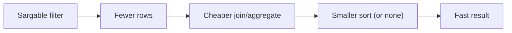

When a query feels slow, you want to answer three questions:

1) What work is the database doing?
2) Why did it choose that work?
3) What change would make it faster?

`EXPLAIN` is the tool that shows you the answer.

This lesson teaches:

- how to read an `EXPLAIN` plan like a beginner
- what the most common plan nodes mean
- what indexes can (and can’t) do for you

---

## `EXPLAIN` vs `EXPLAIN ANALYZE`

- `EXPLAIN` shows the plan PostgreSQL *intends* to run.
- `EXPLAIN ANALYZE` actually runs the query and shows:
  - real timing
  - real row counts

In this project, you can run both from the Exercise page (after running your query once).

Practical rule:

> Use `EXPLAIN` for understanding shape, and `EXPLAIN ANALYZE` for truth.

---

## How to read a plan (beginner strategy)

Plans are trees. The database starts at the **bottom** and flows upward.

The top node is the final result.

When you’re new, focus on:

1) Which node has the biggest time?
2) Where are the biggest row counts?
3) Are estimates close to actual?

In `EXPLAIN ANALYZE`, you’ll see fields like:

- `actual time=...`
- `rows=...`
- `loops=...`

If estimates are wildly wrong, the planner may pick the wrong strategy.

---

## Common plan nodes (what they mean)

Here are the most common ones you’ll see:

| Node | Meaning (simple) | When it’s good / bad |
|---|---|---|
| `Seq Scan` | read the whole table | fine for small tables; can be slow for huge tables |
| `Index Scan` | use an index to find rows | great when filter is selective |
| `Index Only Scan` | satisfy query from index alone | very fast when possible |
| `Sort` | sort rows | can be expensive if sorting lots of rows |
| `HashAggregate` | group/aggregate using hashing | common for `GROUP BY` |
| `Nested Loop` | for each row, look up matches | great when left side small and right side indexed |
| `Hash Join` | build hash table and probe | common for big equality joins |
| `Merge Join` | merge two sorted inputs | good when inputs already sorted/indexed |

You don’t need to memorize everything at once. Start with `Seq Scan`, `Index Scan`, and `Sort`.

---

## What an index can do (the practical truth)

An index helps when PostgreSQL can quickly locate a small subset of rows.

Indexes are especially helpful for:

- equality filters (`WHERE id = ...`)
- range filters (`WHERE created_at >= ... AND created_at < ...`)
- `ORDER BY ... LIMIT` when the order matches the index

Indexes are not magic:

- if you return most of the table, scanning may be faster than using the index
- indexes cost disk space and make writes slower (they must be maintained)

---

## Sargability: don’t wrap the column

A filter is **sargable** when the database can use an index efficiently.

Prefer predicates that compare the column directly:

```sql
-- Good: compares the column directly (index-friendly)
SELECT COUNT(*) AS likes_today
FROM social_likes
WHERE created_at >= CURRENT_DATE
  AND created_at < CURRENT_DATE + INTERVAL '1 day';
```

Avoid applying functions to the column when possible:

```sql
-- Often worse: function on the column (harder to use index)
SELECT COUNT(*) AS likes_today
FROM social_likes
WHERE DATE(created_at) = CURRENT_DATE;
```

---

## Example 1: “latest like timestamp” (`ORDER BY ... LIMIT 1`)

Two equivalent queries:

```sql
SELECT MAX(created_at) AS latest_like_time
FROM social_likes;
```

```sql
SELECT created_at AS latest_like_time
FROM social_likes
ORDER BY created_at DESC
LIMIT 1;
```

With a supporting index on `created_at`, the `ORDER BY ... LIMIT 1` form can be extremely fast because the database can jump to the “end” of the index.

Example index shape (conceptual):

```sql
CREATE INDEX ON social_likes (created_at DESC);
```

---

## Example 2: “likes today” (range filter)

```sql
SELECT COUNT(*) AS likes_today
FROM social_likes
WHERE created_at >= CURRENT_DATE
  AND created_at < CURRENT_DATE + INTERVAL '1 day';
```

If there’s an index on `created_at`, `EXPLAIN` is more likely to show an index-based scan than a full scan.

Why:

- the predicate describes a contiguous range in time
- indexes are ordered, so ranges are efficient

---

## Example 3: join plans and indexes (why FK indexes matter)

Suppose you join orders to customers:

```sql
SELECT o.id, c.id AS customer_id
FROM ecommerce_orders o
JOIN ecommerce_customers c ON c.id = o.customer_id
WHERE o.order_date >= CURRENT_DATE - INTERVAL '7 days';
```

Indexes that often matter here:

- `ecommerce_orders(customer_id)` (join key)
- `ecommerce_orders(order_date)` (filter key)

If the join key is not indexed on the “many” side, joins can become much slower as the dataset grows.

---

## Common pitfalls (and what to do)

### Pitfall 1: optimizing before it’s correct

Always write the correct query first, then optimize.

### Pitfall 2: reading only the top node

The top node shows total time, but the *cause* is often a deep node like a huge `Sort` or `Seq Scan`.

### Pitfall 3: missing deterministic ordering in top‑N queries

If your result must be ordered, specify tie-breakers:

```sql
ORDER BY comment_count DESC, user_id ASC
```

This is both a correctness requirement and a testing requirement.

### Pitfall 4: join multiplication

Joining multiple one-to-many tables and then aggregating can explode row counts.

Fix:

- pre-aggregate each “many” side
- then join aggregates

---

## A simple workflow you can repeat

1) Run the query normally and confirm it’s correct.
2) Run `EXPLAIN` and check:
   - do you see `Seq Scan` on a huge table?
   - do you see a huge `Sort`?
3) Run `EXPLAIN ANALYZE` and find the slowest node.
4) Apply one high-impact change:
   - rewrite predicates to be sargable
   - add a targeted index
   - pre-aggregate before joins
5) Re-run `EXPLAIN ANALYZE` to confirm improvement.

---

## Diagram: the “fast plan” recipe



---

## Practice: check yourself

1) For “likes today”, compare:
   - `DATE(created_at) = CURRENT_DATE`
   - `created_at >= CURRENT_DATE AND created_at < CURRENT_DATE + INTERVAL '1 day'`
   Which one is more index-friendly, and why?
2) Pick a query that returns the “latest” row and add a deterministic tie-breaker.
3) Run `EXPLAIN ANALYZE` on a query that feels slow. What node has the highest time?

---

## Summary

- `EXPLAIN` shows plan shape; `EXPLAIN ANALYZE` shows real work.
- Indexes help with selective filters, ranges, and aligned `ORDER BY ... LIMIT`.
- Prefer sargable predicates and deterministic ordering.
- Optimize with a repeatable loop: measure → change → re-measure.
