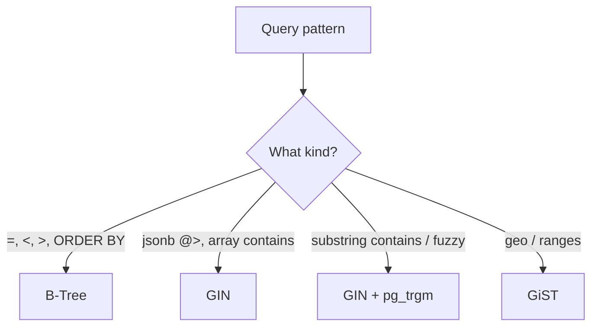

You already know the basics: an index can make selective lookups fast.

This lesson covers the “next level” index tools you’ll run into in PostgreSQL:

- **partial indexes**: index only the rows you care about
- **expression indexes**: index a computed expression
- **GIN** indexes: for `jsonb`, arrays, and trigram search
- **GiST** indexes: for ranges, geospatial data, and more

The goal is practical: understand what problem each index type solves so you pick the right one.

---

## Before advanced indexes: ask “what is the query pattern?”

Indexes are designed around **query patterns**.

When you tune a query, identify:

- what columns are filtered (`WHERE`)
- what columns are joined (`JOIN ON`)
- what columns are sorted (`ORDER BY`)
- whether matching is equality, range, or “contains”

Then choose the smallest index that supports that pattern.

---

## 1) Partial indexes (index only a subset)

A partial index indexes only rows that match a predicate.

This is great when:

- you frequently query a subset
- that subset is small

### Example: verified users

If verified users are rare and you query them often:

```sql
CREATE INDEX idx_social_users_verified
ON social_users (id)
WHERE is_verified = true;
```

Now queries like:

```sql
SELECT id
FROM social_users
WHERE is_verified = true
ORDER BY id ASC
LIMIT 100;
```

can use a smaller index than “index every user”.

### When partial indexes shine

- status-based tables (`WHERE status = 'solved'`)
- “active” flags (`WHERE is_active = true`)
- recent rows (`WHERE created_at >= CURRENT_DATE - INTERVAL '30 days'`) (advanced usage)

---

## 2) Expression indexes (index a computed value)

An expression index indexes the result of an expression, not the raw column.

This helps when your query *must* apply an expression to the column.

### Example: case-insensitive equality

```sql
CREATE INDEX idx_social_users_lower_username
ON social_users (LOWER(username));
```

Then this query can use that index:

```sql
SELECT id, username
FROM social_users
WHERE LOWER(username) = LOWER('SamReddy');
```

Practical note:

- If you can avoid wrapping the column (by storing normalized data), do that.
- Expression indexes are a tool when the query shape is fixed.

### Example: indexing `DATE(created_at)` (usually not the first choice)

You *can* do:

```sql
CREATE INDEX ON social_likes (DATE(created_at));
```

But in many cases, rewriting the query to a range filter is better:

```sql
WHERE created_at >= CURRENT_DATE
  AND created_at < CURRENT_DATE + INTERVAL '1 day'
```

Range filters work with normal B-Tree indexes and also improve partition pruning.

---

## 3) GIN indexes (for `jsonb`, arrays, and trigrams)

GIN indexes are designed for “contains” style operators.

Common uses:

- `jsonb` containment (`@>`)
- trigram search (`pg_trgm`)
- arrays (`@>`, `&&`)

### JSONB example: question ordering config

If you frequently filter by config:

```sql
CREATE INDEX idx_questions_config_gin
ON questions USING GIN (comparison_config);
```

Then queries like:

```sql
SELECT code, title
FROM questions
WHERE comparison_config @> '{"ignore_order": false}'::jsonb;
```

can be much faster.

### Trigram example (contains search)

With `pg_trgm`, a GIN index can speed up:

- `ILIKE '%term%'`

Example:

```sql
CREATE EXTENSION IF NOT EXISTS pg_trgm;
CREATE INDEX idx_social_users_username_trgm
ON social_users USING GIN (username gin_trgm_ops);
```

---

## 4) GiST indexes (geospatial, ranges, specialized types)

GiST is used for:

- PostGIS geospatial data
- range types (e.g., `tsrange`)
- some “nearest neighbor” queries

In SQL Arena’s current schemas, you may not need GiST often, but it’s good to know it exists when your data isn’t a simple scalar.

---

## Choosing the right index (simple rule-of-thumb)

- equality/range/order: **B-Tree**
- “contains” on `jsonb`/arrays: **GIN**
- substring contains / fuzzy: **GIN + pg_trgm**
- geo/range types: **GiST**

---

## Common mistakes (and fixes)

### Mistake 1: indexing everything “just in case”

Indexes have costs:

- disk space
- slower inserts/updates/deletes

Start with the query pattern first, then add the index.

### Mistake 2: partial index that doesn’t match your query

If the query’s predicate doesn’t match the partial index predicate, PostgreSQL can’t use it.

### Mistake 3: using expression indexes when a range rewrite is simpler

Prefer range predicates for timestamps whenever possible.

---

## Diagram: index types at a glance



---

## Practice: check yourself

1) When is a partial index better than a normal index?
2) Why can an expression index help with `LOWER(username)` filters?
3) Which index type is most common for `jsonb` containment queries?
4) For “likes today”, why is a range filter usually better than indexing `DATE(created_at)`?

---

## Summary

- Partial indexes shrink the indexed data to what you query most.
- Expression indexes help when queries must transform columns.
- GIN powers “contains” queries like `jsonb @>` and trigram search.
- GiST is for more complex data types like geospatial and ranges.
