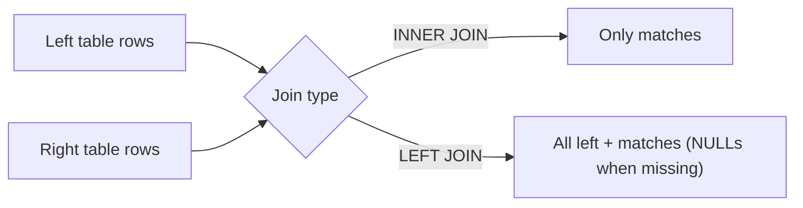

Most real databases store information across multiple tables.

Joins are how you bring that information back together.

This lesson teaches the essentials:

- `INNER JOIN` vs `LEFT JOIN`
- joining on keys (primary key / foreign key)
- how to avoid common beginner join bugs
- how to “read” an ER relationship as a join

Examples use SQL Arena’s `social_*` and `ecommerce_*` tables.

---

## Why joins exist

A good schema avoids duplication (normalization).

That means:

- a post stores `user_id`, not the user’s whole profile
- an order stores `customer_id`, not the customer’s name/address in every row

Joins let you combine those related rows when you need a full view.

---

## The core idea: match rows by a key

The most common join is:

- a foreign key column equals a primary key column

Example:

- `social_posts.user_id` references `social_users.id`

---

## 1) `INNER JOIN` (only rows that match)

```sql
SELECT
  p.id AS post_id,
  p.created_at,
  u.id AS user_id,
  u.username
FROM social_posts p
JOIN social_users u ON u.id = p.user_id
ORDER BY p.created_at DESC, p.id DESC
LIMIT 20;
```

Meaning:

- keep only posts that have a matching user row

`JOIN` without a keyword is the same as `INNER JOIN`.

---

## 2) `LEFT JOIN` (keep left rows even if no match)

Use `LEFT JOIN` when “missing relationship” should still be shown.

Example: show posts and their like counts, including posts with zero likes.

```sql
WITH like_counts AS (
  SELECT post_id, COUNT(*) AS like_count
  FROM social_likes
  GROUP BY post_id
)
SELECT
  p.id AS post_id,
  COALESCE(l.like_count, 0) AS like_count
FROM social_posts p
LEFT JOIN like_counts l ON l.post_id = p.id
ORDER BY like_count DESC, post_id ASC
LIMIT 20;
```

Why `COALESCE`:

- posts with no likes have no row in `like_counts`
- `LEFT JOIN` produces `NULL` for `like_count`
- `COALESCE(..., 0)` turns that into 0

---

## 3) Joining more than two tables

Example: count likes per post and show the post owner.

```sql
WITH like_counts AS (
  SELECT post_id, COUNT(*) AS like_count
  FROM social_likes
  GROUP BY post_id
)
SELECT
  p.id AS post_id,
  u.username,
  COALESCE(l.like_count, 0) AS like_count
FROM social_posts p
JOIN social_users u ON u.id = p.user_id
LEFT JOIN like_counts l ON l.post_id = p.id
ORDER BY like_count DESC, post_id ASC
LIMIT 20;
```

---

## 4) Joining in ecommerce: orders → customers

```sql
SELECT
  o.id AS order_id,
  o.order_date,
  c.id AS customer_id,
  c.first_name,
  c.last_name
FROM ecommerce_orders o
JOIN ecommerce_customers c ON c.id = o.customer_id
ORDER BY o.order_date DESC, o.id DESC
LIMIT 20;
```

---

## 5) How joins affect row counts

Joins can change the number of rows:

- `INNER JOIN` can reduce rows (drops non-matching rows)
- `LEFT JOIN` keeps left rows, but can still expand rows if the right side has multiple matches

Example: if a post has 10 likes, joining raw likes creates 10 rows for that post.

That’s why “count correctness” matters (see join patterns + pre-aggregation).

---

## Common mistakes (and fixes)

### Mistake 1: missing or wrong join condition

This is wrong (cartesian explosion):

```sql
SELECT *
FROM social_posts p
JOIN social_users u;
```

Fix: always specify the join keys:

```sql
JOIN social_users u ON u.id = p.user_id
```

### Mistake 2: using `JOIN` when you need `LEFT JOIN`

If you want to keep left rows even when the relationship is missing, use `LEFT JOIN`.

### Mistake 3: joining raw many-side tables, then aggregating

If you join likes and comments directly to posts and then count, you can inflate counts.

Fix: pre-aggregate likes/comments per post first, then join.

---

## Diagram: `INNER JOIN` vs `LEFT JOIN`



---

## Practice: check yourself

1) Join `social_posts` to `social_users` and return `post_id`, `username`, `created_at`.
2) Return the number of likes per post (including posts with zero likes).
3) Join `ecommerce_orders` to `ecommerce_customers` and return the most recent 20 orders with customer names.
4) Explain in one sentence what `LEFT JOIN` does differently from `INNER JOIN`.

---

## Summary

- Joins combine rows from related tables using matching keys.
- `INNER JOIN` returns only matches.
- `LEFT JOIN` keeps all left rows and fills missing right-side values with `NULL`.
- Always write correct join conditions; pre-aggregate many-side tables to keep counts correct.
