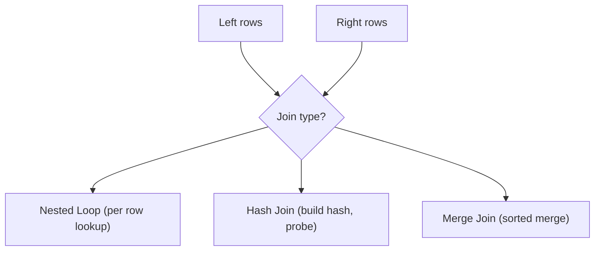

You already know how to *write* joins.

This lesson helps you understand how PostgreSQL *executes* joins, so you can:

- interpret `EXPLAIN` / `EXPLAIN ANALYZE`
- diagnose slow joins
- predict which indexes will help

In PostgreSQL, the most common join algorithms you’ll see are:

- **Nested Loop**
- **Hash Join**
- **Merge Join**

You don’t need to memorize all details — you just need the intuition so plans become readable.

---

## Why it matters

Real schemas are relational by design, so joins are everywhere:

- posts ↔ users
- orders ↔ customers
- likes/comments ↔ posts

When tables get large, the join strategy can be the difference between:

- milliseconds
- minutes

---

## A beginner strategy for reading join plans

When you run `EXPLAIN ANALYZE`, do this:

1) Find the slowest node (largest `actual time`).
2) Look for join nodes (`Nested Loop`, `Hash Join`, `Merge Join`).
3) Check row counts:
   - are estimates close to actual?
   - is one side huge unexpectedly?
4) Ask: “Why did it choose this join type?”

If estimates are way off, PostgreSQL may choose the wrong join strategy.

---

## Join algorithm 1: Nested Loop

### Intuition

- take a row from the left side
- look up matching rows on the right side
- repeat for every left row

This is great when:

- the left side is small
- the right side has an index that makes lookups cheap

### Example: join by primary key (fast lookup)

```sql
SELECT p.id, u.username
FROM social_posts p
JOIN social_users u ON u.id = p.user_id
WHERE p.id = 42;
```

Why it can be fast:

- `p.id = 42` returns ~1 row
- `u.id` is a primary key (indexed)
- the join becomes “one index lookup”

### When nested loop becomes slow

Nested loops can be terrible when:

- left side is large
- right side lookups are expensive (no index)

Then you can end up doing “millions of lookups”.

---

## Join algorithm 2: Hash Join

### Intuition

- build a hash table on one side (often the smaller side)
- scan the other side and probe the hash table

Hash joins are great for:

- large equality joins (`=`) without helpful ordering
- joining two large sets efficiently in memory

### Example: join aggregated comment counts to posts

```sql
SELECT c.post_id, c.comment_count
FROM (
  SELECT post_id, COUNT(*) AS comment_count
  FROM social_comments
  GROUP BY post_id
) c
JOIN social_posts p ON p.id = c.post_id;
```

Here, PostgreSQL can build a hash table of `p.id` values (or of `c.post_id` values), then match efficiently.

### When hash joins struggle

- if the hash table doesn’t fit in memory, it may spill to disk (slower)
- if the join isn’t equality-based, hash joins are not used

---

## Join algorithm 3: Merge Join

### Intuition

Merge join is like merging two sorted lists:

- both inputs are sorted by the join key
- PostgreSQL walks them in order and matches as it goes

Merge joins are great when:

- both sides are already sorted by the join key
- or sorting is cheap relative to the join cost
- indexes can supply sorted order

### When you’ll see merge joins

You often see merge joins when:

- joining two large sets with indexes on the join keys
- you also need sorted output (so the sort work is “shared”)

---

## What changes the join plan?

PostgreSQL chooses join strategies based on:

- table sizes (estimated and actual)
- selectivity of filters (`WHERE`)
- available indexes
- whether inputs are sorted (or need sorting)
- memory settings (hash joins need memory)

Small changes to a filter can flip a plan:

- from hash join to nested loop
- from seq scan to index scan

That’s why `EXPLAIN ANALYZE` is so valuable.

---

## A critical correctness + performance concept: join multiplication

If you join multiple “many” tables and then aggregate, you can multiply rows.

Example:

- posts → likes (many)
- posts → comments (many)

Bad pattern (can inflate counts and be slow):

```sql
SELECT p.id, COUNT(l.*) AS likes, COUNT(c.*) AS comments
FROM social_posts p
LEFT JOIN social_likes l ON l.post_id = p.id
LEFT JOIN social_comments c ON c.post_id = p.id
GROUP BY p.id;
```

Fix: pre-aggregate each many-side, then join:

```sql
WITH likes AS (
  SELECT post_id, COUNT(*) AS like_count
  FROM social_likes
  GROUP BY post_id
),
comments AS (
  SELECT post_id, COUNT(*) AS comment_count
  FROM social_comments
  GROUP BY post_id
)
SELECT
  p.id AS post_id,
  COALESCE(l.like_count, 0) AS like_count,
  COALESCE(c.comment_count, 0) AS comment_count
FROM social_posts p
LEFT JOIN likes l ON l.post_id = p.id
LEFT JOIN comments c ON c.post_id = p.id;
```

This improves:

- correctness (counts aren’t inflated)
- performance (far fewer rows in joins)

---

## Indexes that often help joins

If you join on a foreign key column, indexing that column is often a big win.

Examples:

- `social_likes(post_id)`
- `social_comments(post_id)`
- `ecommerce_orders(customer_id)`
- `ecommerce_order_items(order_id)`

If a join key isn’t indexed on the “many” side, the database may need to scan the many-side repeatedly.

---

## Diagram: join algorithm intuition



---

## Practice: check yourself

1) Why can a nested loop be very fast for `WHERE p.id = 42` style queries?
2) Which join type(s) typically require equality joins?
3) If you see a huge `Sort` node before a join, what index might help?
4) Why can joining likes and comments directly to posts inflate counts?

---

## Summary

- Nested loops are great for “small left side + indexed lookup”.
- Hash joins are great for large equality joins without useful ordering.
- Merge joins are great when both inputs are sorted by join key.
- Pre-aggregate many-side tables to avoid join multiplication.
- Index foreign key join keys to keep joins fast as data grows.
