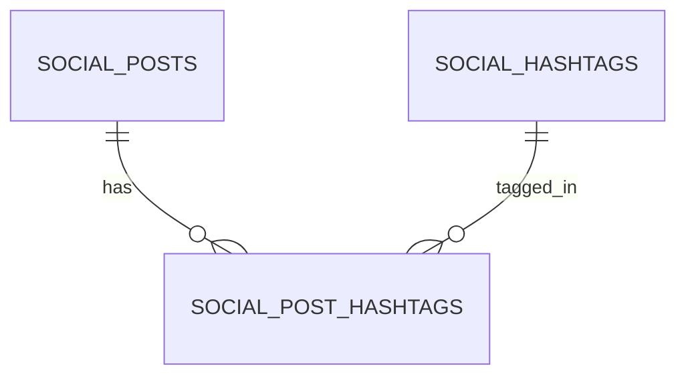
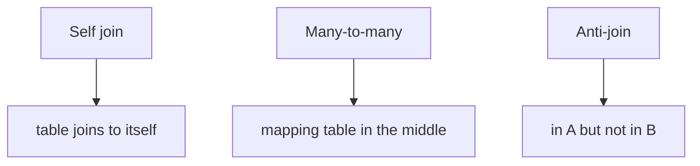

You already know basic joins (`JOIN`, `LEFT JOIN`).

This lesson covers the join patterns you’ll see constantly in real applications:

- **self-joins** (table joins to itself)
- **many-to-many** relationships (mapping tables)
- **anti-joins** (“in A but not in B”)
- **count correctness** (avoiding accidental double-counting)

We’ll use the social schema (follows, hashtags, likes, comments) as our running examples.

---

## Why it matters

Many SQL questions are really “relationship questions”:

- “mutual followers”
- “most used hashtag”
- “users who liked but never commented”
- “posts with likes > comments”

If you know the patterns, you can solve these quickly and correctly.

---

## Pattern 1: self-join (mutual follows)

In a social graph, a “mutual follow” means:

- A follows B
- B follows A

That’s stored as two rows in `social_follows`.

### Count mutual pairs (unique)

```sql
SELECT COUNT(*) AS mutual_pairs
FROM social_follows f1
JOIN social_follows f2
  ON f1.follower_id = f2.followee_id
 AND f1.followee_id = f2.follower_id
WHERE f1.follower_id < f1.followee_id;
```

Why the `<` filter matters:

- without it you count both (A,B) and (B,A)
- `<` keeps one direction so each mutual pair is counted once

### List mutual pairs (not just count)

```sql
SELECT
  LEAST(f1.follower_id, f1.followee_id) AS user_a,
  GREATEST(f1.follower_id, f1.followee_id) AS user_b
FROM social_follows f1
JOIN social_follows f2
  ON f1.follower_id = f2.followee_id
 AND f1.followee_id = f2.follower_id
WHERE f1.follower_id < f1.followee_id
ORDER BY user_a ASC, user_b ASC
LIMIT 50;
```

Output shape:

| user_a | user_b |
|---:|---:|
| 1 | 7 |
| 2 | 9 |

---

## Pattern 2: many-to-many (posts ↔ hashtags)

Many-to-many relationships use a mapping table.



The mapping table’s rows *are the relationship*:

- one row = one hashtag assignment to one post

### Total hashtag usage (count relationship rows)

```sql
SELECT COUNT(*) AS total_hashtag_usage
FROM social_post_hashtags;
```

### Distinct hashtags used (unique hashtag ids)

```sql
SELECT COUNT(DISTINCT hashtag_id) AS distinct_hashtags
FROM social_post_hashtags;
```

### Most used hashtag today (join mapping + posts)

```sql
SELECT
  ph.hashtag_id,
  COUNT(*) AS usage_count
FROM social_post_hashtags ph
JOIN social_posts p ON p.id = ph.post_id
WHERE p.created_at >= CURRENT_DATE
  AND p.created_at < CURRENT_DATE + INTERVAL '1 day'
GROUP BY ph.hashtag_id
ORDER BY usage_count DESC, ph.hashtag_id ASC
LIMIT 1;
```

This is a classic example where the mapping table holds the usage events, but the “today” filter lives on posts.

---

## Pattern 3: anti-join (“in A but not in B”)

Anti-joins answer questions like:

- “users who liked but never commented”
- “products with no reviews”
- “customers with no orders”

There are three common ways to express “A but not B”.

### Option A: `NOT EXISTS` (recommended)

```sql
SELECT DISTINCT l.user_id
FROM social_likes l
WHERE NOT EXISTS (
  SELECT 1
  FROM social_comments c
  WHERE c.user_id = l.user_id
);
```

Why it’s recommended:

- robust with `NULL`
- scales well with indexes
- flexible when the “B condition” is complex

### Option B: `LEFT JOIN ... IS NULL` (also common)

```sql
SELECT DISTINCT l.user_id
FROM social_likes l
LEFT JOIN social_comments c ON c.user_id = l.user_id
WHERE c.user_id IS NULL;
```

This is easy to visualize:

- join possible comment rows
- keep only rows where no match exists

### Option C: `NOT IN` (be careful)

```sql
SELECT DISTINCT user_id
FROM social_likes
WHERE user_id NOT IN (SELECT user_id FROM social_comments);
```

Pitfall:

- if the subquery returns `NULL`, `NOT IN` can behave unexpectedly

Beginner rule:

> If you’re not 100% sure about null behavior, use `NOT EXISTS`.

---

## Count correctness: avoid multiplying rows

The biggest “joins bug” is joining multiple one-to-many tables and then aggregating.

Example: posts → likes (many) and posts → comments (many).

### Bad pattern (counts can explode)

```sql
SELECT p.id, COUNT(l.*) AS likes, COUNT(c.*) AS comments
FROM social_posts p
LEFT JOIN social_likes l ON l.post_id = p.id
LEFT JOIN social_comments c ON c.post_id = p.id
GROUP BY p.id;
```

Why it breaks:

- every like pairs with every comment for the same post

### Fix: pre-aggregate, then join

```sql
WITH likes AS (
  SELECT post_id, COUNT(*) AS like_count
  FROM social_likes
  GROUP BY post_id
),
comments AS (
  SELECT post_id, COUNT(*) AS comment_count
  FROM social_comments
  GROUP BY post_id
)
SELECT
  p.id AS post_id,
  COALESCE(l.like_count, 0) AS like_count,
  COALESCE(c.comment_count, 0) AS comment_count
FROM social_posts p
LEFT JOIN likes l ON l.post_id = p.id
LEFT JOIN comments c ON c.post_id = p.id
ORDER BY post_id ASC
LIMIT 20;
```

Now each post joins to at most one “likes row” and one “comments row”.

---

## Common mistakes (and how to avoid them)

### Mistake 1: using `DISTINCT` to hide join multiplication

Adding `DISTINCT` can hide incorrect joins, but counts can still be wrong.

Fix the query shape instead (pre-aggregate).

### Mistake 2: forgetting tie-breakers in top‑N joins

If you select “most used hashtag”, add tie-breakers:

```sql
ORDER BY usage_count DESC, hashtag_id ASC
```

This makes results deterministic and testable.

### Mistake 3: choosing `JOIN` when you need `LEFT JOIN`

- `JOIN` removes rows without matches
- `LEFT JOIN` keeps them with `NULL` on the right side

Always choose intentionally based on the question.

---

## Diagram: three relationship patterns



---

## Practice: check yourself

1) Find users who follow more than 50 accounts (`social_follows`).
2) Find the most used hashtag among posts created today (join mapping + posts).
3) Find users who liked at least one post but never commented (anti-join).
4) Compute per-post like and comment counts without double-counting (pre-aggregate).

---

## Summary

- Self-joins solve “relationship in both directions” problems like mutual follows.
- Many-to-many relationships require mapping tables; join through them.
- Anti-joins are best expressed with `NOT EXISTS` or `LEFT JOIN ... IS NULL`.
- Pre-aggregate many-side tables before joining to keep counts correct.
