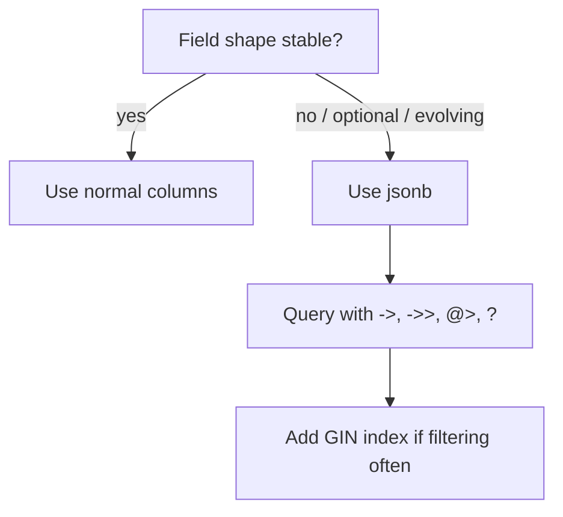

SQL tables are great for structured data, but sometimes you need flexibility:

- per-question configuration that varies by question
- storing arrays like a list of “required order columns”
- semi-structured “columns metadata” for dynamic tables

PostgreSQL’s `jsonb` type is built for this.

In SQL Arena, you already use `jsonb` in multiple places, for example:

- `questions.comparison_config` (ordering rules, flags)
- `questions.tables` and `questions.solution_columns`
- `table_schemas.columns` (schema metadata)

This lesson teaches the beginner-friendly JSONB tools you’ll use the most.

---

## JSON vs JSONB (what’s the difference?)

PostgreSQL supports two JSON types:

- `json`: stored as raw JSON text
- `jsonb`: stored in a binary format designed for querying and indexing

In most applications, prefer `jsonb` because:

- querying is faster and more feature-rich
- indexing (GIN) works well for containment queries

---

## When JSONB is a good idea (and when it isn’t)

### Good fit

- configuration objects with optional keys
- lists/arrays of values
- metadata that changes shape over time

### Not a good fit

- fields you filter on constantly (consider real columns)
- core relational relationships (use foreign keys)

Rule of thumb:

> Use normal columns for stable fields; use JSONB for optional/extensible fields.

---

## The core operators (you’ll use these constantly)

Assume a JSONB column named `comparison_config`.

### `->` vs `->>` (very important)

- `->` returns a JSON value (type `jsonb`)
- `->>` returns text (type `text`)

Example:

```sql
SELECT
  code,
  comparison_config->'sort_by_columns' AS sort_json,
  comparison_config->>'ignore_order' AS ignore_order_text
FROM questions
ORDER BY code ASC
LIMIT 5;
```

### Key existence: `?`

```sql
SELECT code, title
FROM questions
WHERE comparison_config ? 'sort_by_columns';
```

### Containment: `@>`

“Does this JSON contain these key/value pairs?”

```sql
SELECT code, title
FROM questions
WHERE comparison_config @> '{"ignore_order": false}'::jsonb;
```

---

## Example 1: read flags safely (with defaults)

Often a key might be missing. You can default it:

```sql
SELECT
  code,
  COALESCE((comparison_config->>'ignore_order')::boolean, true) AS ignore_order
FROM questions
ORDER BY code ASC
LIMIT 20;
```

Why `COALESCE` helps:

- missing keys return `NULL`
- you can decide the default behavior explicitly

---

## Example 2: working with JSON arrays

Some configs store arrays, like:

```json
{
  "sort_by_columns": [
    {"column": "comment_count", "direction": "desc"},
    {"column": "user_id", "direction": "asc"}
  ]
}
```

### Count how many sort rules a question has

```sql
SELECT
  code,
  jsonb_array_length(COALESCE(comparison_config->'sort_by_columns', '[]'::jsonb)) AS sort_rules
FROM questions
ORDER BY sort_rules DESC, code ASC;
```

### Expand an array into rows (`jsonb_array_elements`)

This is useful for reporting/debugging configs.

```sql
SELECT
  q.code,
  elem->>'column' AS sort_column,
  elem->>'direction' AS direction
FROM questions q
JOIN LATERAL jsonb_array_elements(q.comparison_config->'sort_by_columns') AS elem ON true
ORDER BY q.code ASC;
```

Output shape:

| code | sort_column | direction |
|---|---|---|
| SOCIAL_084 | comment_count | desc |
| SOCIAL_084 | user_id | asc |

---

## Example 3: JSONB for schema metadata (`table_schemas.columns`)

In this project, `table_schemas.columns` is JSONB (often an array of column definitions).

Common uses:

- generate table docs
- render ER diagrams
- build UI forms dynamically

If `columns` is an array, you can list column names like:

```sql
SELECT
  table_name,
  col->>'name' AS column_name,
  col->>'type' AS column_type
FROM table_schemas ts
JOIN LATERAL jsonb_array_elements(ts.columns) AS col ON true
WHERE ts.app_id = (SELECT app_id FROM apps WHERE name = 'social')
ORDER BY table_name ASC, column_name ASC;
```

---

## Indexing JSONB (GIN) for performance

JSONB containment queries (`@>`) can be fast with a GIN index:

```sql
CREATE INDEX idx_questions_comparison_config
ON questions USING GIN (comparison_config);
```

When is this worth it?

- when you frequently filter questions based on config keys/values
- when the questions table is large

Practical note:

- indexes speed up reads but slow down writes a bit

---

## Common mistakes (and fixes)

### Mistake 1: using `->` when you need text

If you write:

```sql
comparison_config->'ignore_order'
```

you get JSON, not text.

If you want to cast to boolean/int, use `->>`:

```sql
(comparison_config->>'ignore_order')::boolean
```

### Mistake 2: forgetting defaults for missing keys

Missing key → `NULL`.

Use `COALESCE` if you want a default behavior.

### Mistake 3: storing everything in JSONB

If you filter on a field constantly and it’s stable, a real column is often better.

---

## Diagram: when JSONB makes sense



---

## Practice: check yourself

1) Find questions where `comparison_config` contains `"ignore_order": false`.
2) Return the number of `sort_by_columns` entries per question (default to `0` when missing).
3) Expand `sort_by_columns` into rows with columns: `code`, `column`, `direction`.
4) In one sentence: why is `jsonb` usually preferred over `json`?

---

## Summary

- JSONB is great for flexible configuration and metadata.
- Use `->` for JSON values and `->>` for text.
- Use `@>` and `?` for filtering; use GIN indexes when it’s a hot path.
- Don’t put everything into JSONB—use real columns for stable, heavily-queried fields.
