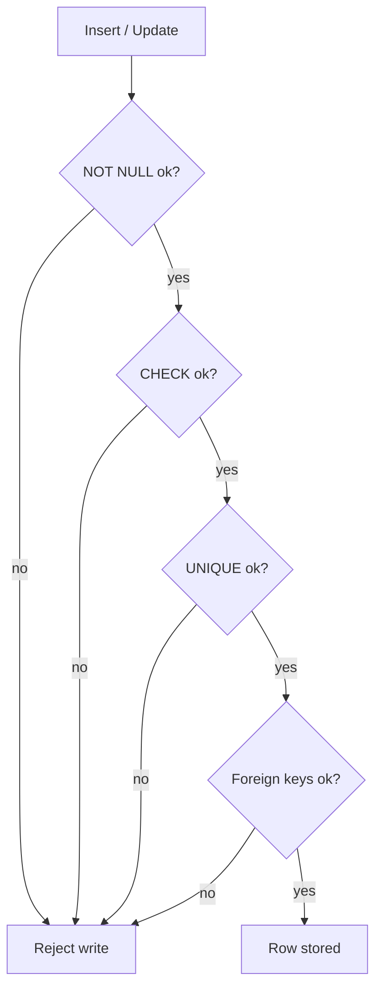

Databases are not just storage — they are **systems that protect correctness**.

Constraints are the database’s guardrails. They prevent invalid data from being stored in the first place.

In SQL Arena, constraints matter because:

- progress rows must always point to real users and questions
- statuses must stay within allowed values (`'not started'`, `'attempted'`, `'solved'`)
- reset scripts must behave predictably when deleting parent rows

This lesson covers the core constraint tools you’ll use in PostgreSQL (and most relational databases):

- primary keys
- unique constraints
- foreign keys (and `ON DELETE` behaviors)
- `CHECK` constraints
- `NOT NULL`

---

## Why “data integrity” is a big deal

If your database allows invalid states, your application code becomes harder:

- every query needs extra defensive checks
- reports become unreliable (“why is user_id 999 in progress when user 999 doesn’t exist?”)
- bugs become permanent because bad rows are now persisted

Constraints push correctness *down* into the database, where it’s enforced consistently.

---

## Primary keys: how do we uniquely identify a row?

A **primary key** uniquely identifies a row.

In this project, most tables use an integer id:

```sql
CREATE TABLE users (
  id SERIAL PRIMARY KEY,
  username TEXT UNIQUE NOT NULL
);
```

### What a primary key gives you

- uniqueness: no two rows share the same primary key
- non-null: primary keys cannot be `NULL`
- indexing: PostgreSQL automatically creates a unique index for the primary key

### Why your joins depend on this

When you join `social_posts` to `social_users`, you usually join on:

- `social_posts.user_id` → `social_users.id`

That only works reliably when `social_users.id` is unique.

---

## Unique constraints: preventing duplicates

`UNIQUE` prevents duplicate values.

Example: `apps.name` should be unique:

```sql
CREATE TABLE apps (
  app_id INTEGER PRIMARY KEY,
  name VARCHAR(50) UNIQUE NOT NULL
);
```

### Composite unique constraints (very common)

Some rows should be unique **as a pair** (or tuple).

Example: hints should be unique per question and order:

```sql
CREATE TABLE hints (
  id SERIAL PRIMARY KEY,
  question_code VARCHAR(30) NOT NULL REFERENCES questions(code) ON DELETE CASCADE,
  hint_order INTEGER NOT NULL,
  content TEXT NOT NULL,
  UNIQUE (question_code, hint_order)
);
```

Interpretation:

- a question can have hint 1, hint 2, hint 3…
- but it cannot have two “hint 2” rows

Composite uniqueness is also what makes safe upserts possible (see the upsert lesson).

---

## Foreign keys: enforcing relationships

A **foreign key** ensures a value references a real row in another table.

Example in this project:

- `questions.app_id` references `apps.app_id`

```sql
CREATE TABLE questions (
  id SERIAL PRIMARY KEY,
  app_id INTEGER NOT NULL REFERENCES apps(app_id) ON DELETE CASCADE,
  title TEXT NOT NULL
);
```

This prevents:

- a question pointing to a non-existent app

---

## `ON DELETE` behavior (what happens when the parent row is deleted?)

Foreign keys can define what happens when the referenced parent row is deleted.

Common options:

### `ON DELETE CASCADE` (delete children automatically)

Best when child rows make no sense without the parent.

Example:

- delete a question → delete its hints

### `ON DELETE SET NULL` (keep child row but remove link)

Best when child can exist without parent, but the relationship becomes unknown/empty.

Example from ecommerce:

- `ecommerce_categories.parent_category_id` uses `ON DELETE SET NULL`
  - if you delete a parent category, children become roots instead of being deleted

### `ON DELETE RESTRICT` / default behavior (block delete)

Best when you never want to delete a parent if it still has children.

This forces you to delete/relocate children first.

---

## `CHECK` constraints: allowing only valid values

Use `CHECK` constraints for small enumerations (difficulty, status, etc.).

Example:

```sql
ALTER TABLE questions
ADD CONSTRAINT chk_questions_difficulty
CHECK (difficulty IN ('easy','medium','hard'));
```

Example: progress status:

```sql
ALTER TABLE user_progress
ADD CONSTRAINT chk_user_progress_status
CHECK (status IN ('not started','attempted','solved'));
```

Why it’s valuable:

- UI controls can still be bypassed (scripts, API bugs)
- `CHECK` makes invalid values impossible to persist

---

## `NOT NULL`: required fields

If a column is required, enforce it.

```sql
CREATE TABLE users (
  id SERIAL PRIMARY KEY,
  username TEXT UNIQUE NOT NULL
);
```

Now you can’t create “half users” with missing usernames.

In general, set `NOT NULL` on:

- identifiers
- required foreign keys
- required fields used in the UI

---

## Constraints in action: what failures look like

You’ll often see errors like:

- “duplicate key value violates unique constraint …”
- “insert or update violates foreign key constraint …”
- “new row violates check constraint …”

Those errors are useful:

- they tell you exactly what rule was violated
- they stop corruption at the boundary

Your job is then to fix the application logic or seed data that caused the bad write.

---

## Diagram: what happens during an insert/update



---

## Real-world examples (SQL Arena)

### Example 1: preventing “orphan progress”

If `user_progress.user_id` references `users.id`, then you cannot write progress for a user that doesn’t exist.

That prevents subtle bugs where:

- the client keeps an old user id after a DB reset
- writes keep “working” but point to nothing real

Failing fast (with a FK violation) is better than storing broken state.

### Example 2: deterministic cleanup with cascades

If hints have:

```sql
REFERENCES questions(code) ON DELETE CASCADE
```

Then deleting a question automatically cleans up its hints.

This makes reset scripts simpler and prevents leftover “dangling hint rows”.

---

## Practice: check yourself

1) Why is `UNIQUE (question_code, hint_order)` useful on the `hints` table?
2) What happens to `questions` when you delete a row from `apps` with `ON DELETE CASCADE`?
3) What’s the difference between `ON DELETE CASCADE` and `ON DELETE SET NULL`?
4) If you store `status` as free text with no `CHECK`, what kinds of bugs appear?

---

## Summary

- Primary keys uniquely identify rows and power safe joins.
- Unique constraints prevent duplicates (including composite uniqueness).
- Foreign keys enforce relationships; `ON DELETE` rules define cleanup behavior.
- `CHECK` constraints enforce allowed values.
- `NOT NULL` prevents “half rows”.
