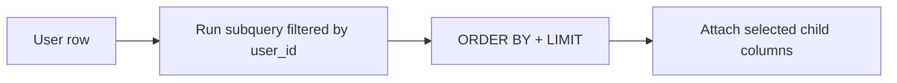

Sometimes you want **one (or a few)** related rows for each row in a “parent” table.

Examples:

- for each user, show their **latest post**
- for each customer, show their **most recent order**
- for each product, show its **latest review**

In PostgreSQL, `LATERAL` is a clean way to write those “run a subquery per parent row” queries.

---

## What `LATERAL` does (in plain language)

A `LATERAL` subquery can reference columns from rows that appear **before it** in the `FROM` clause.

That means the subquery can say things like:

- “for this `u.id`, give me the latest post”

Without `LATERAL`, a subquery in `FROM` cannot see `u.id`.

---

## Why it matters

You can solve “top 1 per group” questions in multiple ways:

- window functions (`ROW_NUMBER()`)
- `DISTINCT ON` (PostgreSQL-specific)
- `LATERAL` (PostgreSQL-specific)

Window functions are usually the most portable and flexible, but `LATERAL` is often:

- more readable (“for each parent row, fetch the child row”)
- efficient when you have a good index and a small `LIMIT`

---

## The standard `LATERAL` pattern

Here’s the shape you’ll use over and over:

```sql
SELECT
  parent_cols...,
  child_cols...
FROM parent_table p
LEFT JOIN LATERAL (
  SELECT ...
  FROM child_table c
  WHERE c.parent_id = p.id
  ORDER BY ...
  LIMIT 1
) child_alias ON true;
```

Key details:

- `LEFT JOIN` keeps parents even when there is no matching child row.
- `ON true` is common because the “join condition” is inside the subquery (`WHERE c.parent_id = p.id`).

---

## Example 1: latest post per user

Goal: show each user and (if present) their latest post id + time.

```sql
SELECT
  u.id AS user_id,
  u.username,
  latest_post.id AS latest_post_id,
  latest_post.created_at AS latest_post_time
FROM social_users u
LEFT JOIN LATERAL (
  SELECT id, created_at
  FROM social_posts p
  WHERE p.user_id = u.id
  ORDER BY p.created_at DESC, p.id DESC
  LIMIT 1
) latest_post ON true
ORDER BY u.id ASC
LIMIT 50;
```

Why the tie-breaker matters:

- if two posts have the same `created_at`, `p.id DESC` makes the “latest” deterministic.

Example output shape:

| user_id | username | latest_post_id | latest_post_time |
|---:|---|---:|---|
| 1 | alice | 991 | 2026-03-31 18:02:11 |
| 2 | bob | NULL | NULL |

---

## Example 2: most recent order per customer

Goal: one row per customer, showing their newest order (if any).

```sql
SELECT
  c.id AS customer_id,
  c.first_name,
  c.last_name,
  o.id AS latest_order_id,
  o.created_at AS latest_order_time
FROM ecommerce_customers c
LEFT JOIN LATERAL (
  SELECT id, created_at
  FROM ecommerce_orders o
  WHERE o.customer_id = c.id
  ORDER BY o.created_at DESC, o.id DESC
  LIMIT 1
) o ON true
ORDER BY c.id ASC
LIMIT 50;
```

This reads like:

> For each customer, run the subquery that picks their latest order.

---

## Example 3: top 3 posts per user (yes, more than 1 row)

`LATERAL` also works when you want more than one row per parent.

Goal: for each user, show up to 3 most recent post ids.

```sql
SELECT
  u.id AS user_id,
  u.username,
  p.id AS post_id,
  p.created_at
FROM social_users u
JOIN LATERAL (
  SELECT id, created_at
  FROM social_posts p
  WHERE p.user_id = u.id
  ORDER BY p.created_at DESC, p.id DESC
  LIMIT 3
) p ON true
ORDER BY u.id ASC, p.created_at DESC, p.id DESC;
```

Practical note:

- This returns multiple rows per user (up to 3).
- You can keep it `LEFT JOIN LATERAL` if you want users with no posts to still appear (with `NULL` child columns).

---

## Window functions vs `LATERAL` (when to choose which)

### Prefer window functions when:

- you need “top N per group” and also want **ranking columns** (`rn`, `rank`, etc.)
- you’re doing more complex filtering after ranking
- portability matters

### Prefer `LATERAL` when:

- you want a readable “per parent lookup”
- you have a good index and small `LIMIT`
- you’re selecting a small number of child columns

Window function equivalent for “latest post per user”:

```sql
SELECT user_id, id AS latest_post_id, created_at AS latest_post_time
FROM (
  SELECT
    p.*,
    ROW_NUMBER() OVER (
      PARTITION BY user_id
      ORDER BY created_at DESC, id DESC
    ) AS rn
  FROM social_posts p
) t
WHERE rn = 1;
```

---

## Common mistakes

### 1) Forgetting deterministic ordering

If you only do:

```sql
ORDER BY created_at DESC
```

ties can pick different rows on different runs. Add a stable tie-breaker like `id`.

### 2) Using `INNER JOIN` when you need “include parents with no children”

- `JOIN LATERAL` removes parent rows that return no child rows.
- `LEFT JOIN LATERAL` keeps them (child columns are `NULL`).

### 3) Doing “per row” work without an index

If the child table is large, the subquery should be supported by an index like:

- `(user_id, created_at DESC)` for posts
- `(customer_id, created_at DESC)` for orders

---

## Diagram: how to think about it



---

## Check yourself

1) Write a `LEFT JOIN LATERAL` query that returns each `ecommerce_products.id` with its latest review (from `ecommerce_reviews`), if any.
2) For “latest order per customer”, what composite index would help most?
3) Convert the `LATERAL` “latest post per user” query into a window-function version using `ROW_NUMBER()`.

---

## Summary

- `LATERAL` lets a subquery in `FROM` reference columns from earlier tables.
- It’s great for “top 1 per parent” and “top N per parent” patterns.
- Make ordering deterministic and choose `LEFT JOIN` vs `JOIN` intentionally.
