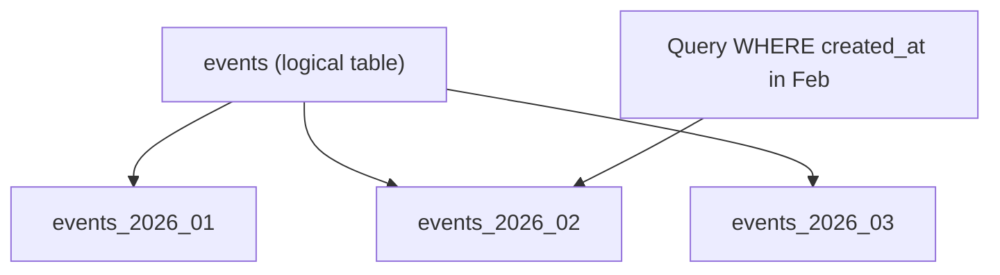

Partitioning is a database technique where one logical table is stored as many smaller physical tables called **partitions**.

Partitioning is most useful for **very large time-series/event tables**, where most queries touch only “recent” data.

Examples of event tables in this project:

- `user_submissions` (one row per attempt)
- `social_likes`, `social_comments`, `social_posts` (one row per event)
- `ecommerce_orders`, `ecommerce_payments` (one row per event)

This lesson explains:

- what partitioning is
- why it helps (partition pruning)
- when it’s worth the complexity

---

## Why partitioning exists

Imagine you have 500 million submissions.

Most product queries are like:

- “last 7 days”
- “today”
- “this month”

Without partitioning, the database still sees one giant table.

With partitioning, the database can skip old partitions entirely.

That skip is called **partition pruning**.

---

## When partitioning helps (and when it doesn’t)

Partitioning helps when:

- the table is huge (millions+ rows)
- most queries filter by `created_at` range
- you want cheap retention (dropping old data)

Partitioning is not necessary when:

- the table is small/moderate
- queries don’t filter by the partition key
- a simple index already makes queries fast

Rule of thumb:

> Partitioning is a scaling tool, not a default schema choice.

---

## Range partitioning by time (monthly partitions)

The most common event-table pattern is range partitioning by month.

Conceptual example:

```sql
CREATE TABLE events (
  id BIGSERIAL PRIMARY KEY,
  created_at timestamptz NOT NULL,
  payload jsonb NOT NULL
) PARTITION BY RANGE (created_at);

CREATE TABLE events_2026_01 PARTITION OF events
FOR VALUES FROM ('2026-01-01') TO ('2026-02-01');

CREATE TABLE events_2026_02 PARTITION OF events
FOR VALUES FROM ('2026-02-01') TO ('2026-03-01');
```

Now `events` is the logical table, but rows are stored inside partition tables.

---

## Partition pruning (the core benefit)

If you query a specific time range:

```sql
SELECT COUNT(*)
FROM events
WHERE created_at >= '2026-02-10'
  AND created_at < '2026-02-20';
```

PostgreSQL can skip (`prune`) partitions that are outside February.

That means:

- fewer blocks to read
- fewer rows to process
- faster queries

### Why sargable predicates matter even more with partitioning

Pruning works best when your query filter is a direct range on the partition key.

This is great:

```sql
WHERE created_at >= CURRENT_DATE
  AND created_at < CURRENT_DATE + INTERVAL '1 day'
```

This can be worse:

```sql
WHERE DATE(created_at) = CURRENT_DATE
```

Because it hides the partition key behind a function.

---

## Example: if `user_submissions` became huge

If `user_submissions` grows massively, partitioning by `created_at` could help queries like:

```sql
SELECT DATE(created_at) AS day, COUNT(*) AS attempts
FROM user_submissions
WHERE user_id = 1
  AND created_at >= CURRENT_DATE - INTERVAL '29 days'
  AND created_at < CURRENT_DATE + INTERVAL '1 day'
GROUP BY DATE(created_at)
ORDER BY day ASC;
```

Partitioning won’t magically speed up everything, but it can reduce how much of the table is even considered.

---

## Indexes with partitioning

Partitions usually need their own indexes.

Two common realities:

- you might create indexes on each partition
- or create them on the parent so they propagate (depends on Postgres setup/version)

You still need indexes for things like:

- `(user_id, created_at)` for “recent submissions per user”
- join keys like `(post_id)` for likes/comments

Partitioning is not a replacement for indexing.

---

## Retention is where partitioning shines

Deleting old rows is expensive:

```sql
DELETE FROM events
WHERE created_at < '2025-01-01';
```

With partitions, you can drop old partitions quickly:

```sql
DROP TABLE events_2025_01;
```

That’s why partitioning is popular for logs and analytics event tables.

---

## Tradeoffs (be honest)

Partitioning adds operational complexity:

- more tables to manage
- partition creation automation
- indexes/constraints per partition
- more complex planning and maintenance

If your dataset isn’t huge, a good schema + good indexes + good predicates are often enough.

---

## Diagram: one logical table, many partitions



---

## Practice: check yourself

1) In one sentence: what is partition pruning?
2) Why do sargable range filters matter even more on partitioned tables?
3) Name one reason to partition and one reason not to.

---

## Summary

- Partitioning splits a table into time-based chunks to let PostgreSQL skip irrelevant data.
- It helps most for huge event tables with time-range queries and retention needs.
- You still need good indexes and sargable predicates.
