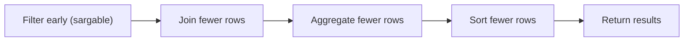

Performance tuning can feel overwhelming, but most big wins come from a small set of patterns.

This lesson focuses on the highest-impact ideas that show up repeatedly in real SQL work.

Goal:

- avoid query shapes that accidentally turn “fast” into “scan everything”
- write queries the optimizer can execute efficiently

We’ll use examples from SQL Arena’s schemas.

---

## The performance mindset (beginner-friendly)

Before you tune anything, remember:

1) Write the correct query first.
2) Make ordering deterministic if the question requires ordering.
3) Only then optimize — ideally using `EXPLAIN ANALYZE`.

Most of the time, optimization is about reducing work:

- fewer rows to scan
- fewer rows to join
- fewer rows to sort

---

## Pattern 1: sargability (don’t wrap the column)

A predicate is **sargable** when PostgreSQL can use an index efficiently.

### Good: range filters on the column

```sql
SELECT COUNT(*) AS likes_today
FROM social_likes
WHERE created_at >= CURRENT_DATE
  AND created_at < CURRENT_DATE + INTERVAL '1 day';
```

### Often worse: function applied to the column

```sql
SELECT COUNT(*) AS likes_today
FROM social_likes
WHERE DATE(created_at) = CURRENT_DATE;
```

Why it’s worse:

- the database must compute `DATE(created_at)` for many rows
- it often can’t use a plain index on `created_at` effectively

Beginner rule:

> Prefer `created_at >= start AND created_at < end` for time filters.

---

## Pattern 2: reduce data early (filter before grouping/sorting)

If you only need the last 30 days, filter early:

```sql
SELECT DATE(created_at) AS day, COUNT(*) AS posts
FROM social_posts
WHERE created_at >= CURRENT_DATE - INTERVAL '29 days'
  AND created_at < CURRENT_DATE + INTERVAL '1 day'
GROUP BY DATE(created_at)
ORDER BY day ASC;
```

Filtering early reduces:

- rows to group
- rows to sort

---

## Pattern 3: avoid join multiplication (pre-aggregate)

Classic trap:

- posts → likes (many)
- posts → comments (many)
- join both raw tables, then aggregate

That can multiply rows: each like pairs with each comment.

### Bad shape (counts can explode)

```sql
SELECT p.id, COUNT(l.*) AS likes, COUNT(c.*) AS comments
FROM social_posts p
LEFT JOIN social_likes l ON l.post_id = p.id
LEFT JOIN social_comments c ON c.post_id = p.id
GROUP BY p.id;
```

### Good shape: pre-aggregate each many-side, then join

```sql
WITH likes AS (
  SELECT post_id, COUNT(*) AS like_count
  FROM social_likes
  GROUP BY post_id
),
comments AS (
  SELECT post_id, COUNT(*) AS comment_count
  FROM social_comments
  GROUP BY post_id
)
SELECT
  p.id AS post_id,
  COALESCE(l.like_count, 0) AS like_count,
  COALESCE(c.comment_count, 0) AS comment_count
FROM social_posts p
LEFT JOIN likes l ON l.post_id = p.id
LEFT JOIN comments c ON c.post_id = p.id
ORDER BY p.id ASC
LIMIT 20;
```

Why it’s faster and safer:

- fewer rows flowing through the join
- counts are correct by construction

---

## Pattern 4: choose the right anti-join

“In A but not in B” is common:

- users who liked but never commented
- products with no reviews
- customers who never ordered

### Recommended: `NOT EXISTS`

```sql
SELECT DISTINCT l.user_id
FROM social_likes l
WHERE NOT EXISTS (
  SELECT 1
  FROM social_comments c
  WHERE c.user_id = l.user_id
);
```

Why it’s good:

- handles `NULL` safely
- scales well with indexes

### Be careful with `NOT IN`

If the subquery can return `NULL`, `NOT IN` can behave unexpectedly.

Prefer `NOT EXISTS` unless you’re sure about null behavior.

---

## Pattern 5: make `ORDER BY ... LIMIT` cheap (and stable)

Top‑N queries are extremely common.

Example: top 5 users by interactions:

```sql
SELECT user_id, COUNT(*) AS interactions
FROM (
  SELECT user_id FROM social_likes
  UNION ALL
  SELECT user_id FROM social_comments
) t
GROUP BY user_id
ORDER BY interactions DESC, user_id ASC
LIMIT 5;
```

Two performance/correctness tips:

1) Add tie-breakers (`user_id ASC`) so results are deterministic.
2) If you frequently need “latest row”, indexes can make it extremely fast (`ORDER BY created_at DESC LIMIT 1`).

---

## Pattern 6: avoid “SELECT *” in heavy queries

`SELECT *` is fine for exploration, but for performance:

- it moves more data
- it prevents some index-only scans

Prefer selecting only needed columns, especially in joins and large scans.

---

## Pattern 7: understand what indexes help

High-value indexes usually target:

- join keys (`post_id`, `user_id`, `customer_id`)
- time filters (`created_at`)
- “recent per user” patterns (`(user_id, created_at DESC)`)

Indexes won’t help much when:

- you return most rows anyway
- filters are not selective

---

## Diagram: what you want the optimizer to do



---

## A practical workflow you can repeat

1) Make it correct.
2) Add deterministic ordering (if required by the question).
3) Run `EXPLAIN` / `EXPLAIN ANALYZE`:
   - look for huge `Seq Scan`, big `Sort`, or join explosion
4) Apply one high-impact change:
   - sargable time ranges
   - pre-aggregation
   - targeted index
5) Re-run `EXPLAIN ANALYZE` to confirm improvement.

---

## Practice: check yourself

1) Rewrite `DATE(created_at) = CURRENT_DATE` as a sargable range.
2) Explain (in words) why joining likes + comments without pre-aggregation inflates counts.
3) Write a “latest like time” query that uses `ORDER BY ... LIMIT 1` and a deterministic tie-breaker.
4) Identify one table in the project where an index on a foreign key would likely help (and why).

---

## Summary

- Big performance wins usually come from query shape, not micro-optimizations.
- Prefer sargable range filters over functions on columns.
- Pre-aggregate before joining multiple one-to-many tables.
- Use `NOT EXISTS` for anti-joins.
- Make top‑N queries deterministic and index-friendly.
