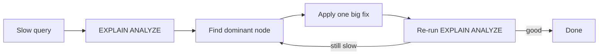

When a query is slow, the easiest mistake is guessing:

- “add an index”
- “rewrite it with a CTE”
- “maybe PostgreSQL is slow today”

Instead, use a repeatable workflow:

1) confirm the problem
2) measure with `EXPLAIN ANALYZE`
3) identify the dominant cost
4) apply one high-impact fix
5) re-measure

This lesson shows a practical tuning loop you can reuse on almost any query.

---

## Step 1: confirm what “slow” means

Before tuning, make sure you know:

- what query is slow
- what input size makes it slow
- whether it’s consistently slow or occasionally slow

In real systems, caching can make a query feel fast the second time. That’s normal.

In learning environments, you still want to be able to explain *why* it’s slow the first time.

---

## Step 2: run `EXPLAIN` and `EXPLAIN ANALYZE`

### `EXPLAIN`

Tells you the plan shape:

- scan type (`Seq Scan` vs `Index Scan`)
- join type (`Hash Join`, `Nested Loop`)
- big operations (`Sort`, `Aggregate`)

### `EXPLAIN ANALYZE`

Runs the query and shows:

- actual runtime
- actual row counts per node
- whether estimates were wrong

Beginner tip:

> Find the node with the biggest time. That’s the current bottleneck.

---

## Step 3: look for the “dominant cost”

Most slow queries are slow for one of these reasons:

1) scanning too many rows
2) sorting too many rows
3) joining too many rows (or multiplying rows)
4) aggregating too many rows

The plan usually makes it obvious which one dominates.

---

## Step 4: apply one high-impact fix

Here are the highest-leverage fixes (in order of how often they help):

### Fix A: make filters sargable

Less sargable:

```sql
WHERE DATE(created_at) = CURRENT_DATE
```

More sargable:

```sql
WHERE created_at >= CURRENT_DATE
  AND created_at < CURRENT_DATE + INTERVAL '1 day'
```

This often changes a plan from scanning the whole table to scanning a small index range (if indexed).

---

### Fix B: filter earlier (reduce data before expensive steps)

If you only need the last 30 days, filter before grouping/sorting:

```sql
SELECT DATE(created_at) AS day, COUNT(*) AS posts
FROM social_posts
WHERE created_at >= CURRENT_DATE - INTERVAL '29 days'
  AND created_at < CURRENT_DATE + INTERVAL '1 day'
GROUP BY DATE(created_at)
ORDER BY day ASC;
```

---

### Fix C: add a targeted index

Indexes help when:

- the filter is selective
- the query uses the index’s order (`ORDER BY ... LIMIT`)

Common “event table” index shapes:

- `(created_at)`
- `(user_id, created_at DESC)`
- join keys like `(post_id)`, `(customer_id)`

Don’t add indexes blindly—use `EXPLAIN` to verify whether the planner uses them.

---

### Fix D: pre-aggregate to avoid join multiplication

Classic anti-pattern:

```sql
SELECT p.id, COUNT(l.*) AS likes, COUNT(c.*) AS comments
FROM social_posts p
LEFT JOIN social_likes l ON l.post_id = p.id
LEFT JOIN social_comments c ON c.post_id = p.id
GROUP BY p.id;
```

This can multiply likes by comments.

Fix:

```sql
WITH likes AS (
  SELECT post_id, COUNT(*) AS like_count
  FROM social_likes
  GROUP BY post_id
),
comments AS (
  SELECT post_id, COUNT(*) AS comment_count
  FROM social_comments
  GROUP BY post_id
)
SELECT
  p.id AS post_id,
  COALESCE(l.like_count, 0) AS like_count,
  COALESCE(c.comment_count, 0) AS comment_count
FROM social_posts p
LEFT JOIN likes l ON l.post_id = p.id
LEFT JOIN comments c ON c.post_id = p.id;
```

This reduces rows and often simplifies the join plan.

---

## Step 5: re-measure

After any change:

- re-run `EXPLAIN ANALYZE`
- confirm the slow node improved
- confirm you didn’t change correctness

Tuning is iterative, but don’t do 10 changes at once or you won’t know what helped.

---

## Stats: why estimates can be wrong

PostgreSQL uses table statistics to estimate:

- how many rows match a filter
- which join strategy is best

If stats are stale or the data distribution changed, estimates can be wrong.

Run:

```sql
ANALYZE social_posts;
```

Or:

```sql
ANALYZE;
```

This updates statistics used by the planner.

---

## `VACUUM` (what it’s for)

PostgreSQL uses MVCC, which creates dead tuples over time.

`VACUUM`:

- reclaims space from dead rows
- helps maintain performance

In high-write tables, vacuum matters.

```sql
VACUUM (ANALYZE) social_posts;
```

In many setups, autovacuum handles this automatically—but understanding it explains why performance can degrade after heavy write workloads.

---

## A minimal tuning checklist (fast to apply)

1) Is the predicate sargable?
2) Are you filtering early enough?
3) Are you using deterministic ordering when required?
4) Are you joining raw many-side tables unnecessarily?
5) Are there indexes on:
   - join keys
   - filter keys
   - sort keys for `LIMIT` queries?

---

## Diagram: tuning loop



---

## Practice: check yourself

1) In `EXPLAIN ANALYZE`, what’s the fastest way to spot the biggest time sink?
2) Why can stale stats cause bad plans?
3) Name one fix for each:
   - big sort
   - join multiplication
   - seq scan on a huge table
4) Rewrite `DATE(created_at) = CURRENT_DATE` into a sargable range filter.

---

## Summary

- Measure first (`EXPLAIN ANALYZE`), then fix the biggest bottleneck.
- Most wins come from sargable filters, early reduction, targeted indexes, and avoiding join multiplication.
- Keep stats healthy (`ANALYZE`), and understand the role of `VACUUM`.
