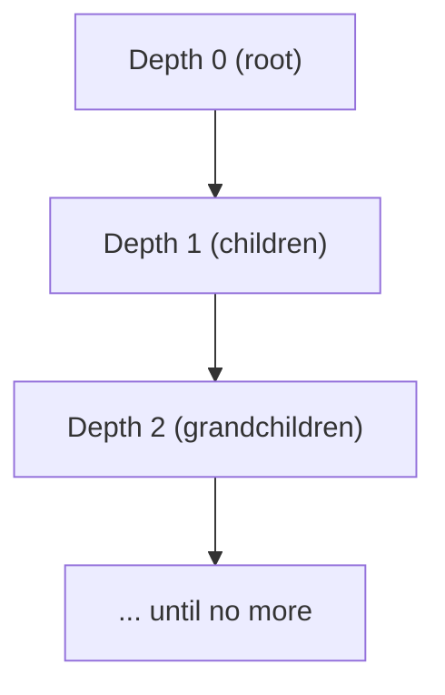

Some data forms a **tree**:

- product categories (Electronics → Laptops → Ultrabooks)
- org charts (CEO → VP → Manager)
- referral chains (A referred B, B referred C)

In SQL, trees are usually stored using a “parent id” column:

- each row points to its parent row

In this project, `ecommerce_categories` has exactly that:

- `ecommerce_categories.parent_category_id` references `ecommerce_categories.id`

Recursive CTEs (`WITH RECURSIVE`) let you traverse that hierarchy using SQL.

---

## Why it matters

Hierarchies show up in real apps, and you often need queries like:

- “show all subcategories of Electronics”
- “show the full breadcrumb path for a category”
- “show depth (level) of each category”

If you can write recursive CTEs, these become straightforward.

---

## The recursive CTE idea (two parts)

A recursive CTE has two queries:

1) **Base query**: the starting row(s)
2) **Recursive query**: how to find the next level of rows

PostgreSQL keeps running the recursive query until it returns no new rows.

---

## Warm-up: generate numbers (simple recursion)

```sql
WITH RECURSIVE t(n) AS (
  SELECT 1
  UNION ALL
  SELECT n + 1
  FROM t
  WHERE n < 5
)
SELECT n FROM t;
```

Output:

| n |
|---:|
| 1 |
| 2 |
| 3 |
| 4 |
| 5 |

This is not the typical use case, but it helps you see the structure.

---

## The category tree in this project

`ecommerce_categories`:

- `id`
- `name`
- `parent_category_id` (nullable, points to parent)

That means:

- root categories have `parent_category_id IS NULL`
- subcategories point to a parent category

---

## Example 1: list all descendants (subtree) of a category

Goal: given a category id, list it and all nested subcategories.

```sql
WITH RECURSIVE subtree AS (
  -- base: start at the chosen category
  SELECT
    id,
    name,
    parent_category_id,
    0 AS depth
  FROM ecommerce_categories
  WHERE id = 10

  UNION ALL

  -- recursive: find children of the rows we already have
  SELECT
    c.id,
    c.name,
    c.parent_category_id,
    s.depth + 1 AS depth
  FROM ecommerce_categories c
  JOIN subtree s ON c.parent_category_id = s.id
)
SELECT id, name, depth
FROM subtree
ORDER BY depth ASC, id ASC;
```

What this does:

- depth `0` is the starting category
- depth `1` is its direct children
- depth `2` is grandchildren
- and so on

Example output shape:

| id | name | depth |
|---:|---|---:|
| 10 | Electronics | 0 |
| 12 | Computers | 1 |
| 15 | Laptops | 2 |

---

## Example 2: build a “breadcrumb path” for each node in the subtree

Often you want to show full paths like:

`Electronics > Computers > Laptops`

We can carry a text path through recursion.

```sql
WITH RECURSIVE subtree AS (
  SELECT
    id,
    name,
    parent_category_id,
    0 AS depth,
    name::text AS path
  FROM ecommerce_categories
  WHERE id = 10

  UNION ALL

  SELECT
    c.id,
    c.name,
    c.parent_category_id,
    s.depth + 1 AS depth,
    (s.path || ' > ' || c.name) AS path
  FROM ecommerce_categories c
  JOIN subtree s ON c.parent_category_id = s.id
)
SELECT id, depth, path
FROM subtree
ORDER BY depth ASC, id ASC;
```

---

## Example 3: find ancestors (walk “up” to the root)

Sometimes you have a category and want to walk upward:

- Laptops → Computers → Electronics → (root)

```sql
WITH RECURSIVE ancestors AS (
  -- base: start at the category
  SELECT
    id,
    name,
    parent_category_id,
    0 AS steps_up
  FROM ecommerce_categories
  WHERE id = 42

  UNION ALL

  -- recursive: move to the parent
  SELECT
    p.id,
    p.name,
    p.parent_category_id,
    a.steps_up + 1 AS steps_up
  FROM ecommerce_categories p
  JOIN ancestors a ON a.parent_category_id = p.id
)
SELECT id, name, steps_up
FROM ancestors
ORDER BY steps_up ASC;
```

This returns:

- the category itself (`steps_up = 0`)
- its parent (`steps_up = 1`)
- its grandparent, etc.

---

## Preventing infinite loops (cycles)

If your data is guaranteed to be a tree, recursion ends naturally.

But if bad data creates cycles (A → B → A), recursion can loop forever unless you guard against it.

One simple guard is to track visited ids:

```sql
WITH RECURSIVE walk AS (
  SELECT
    id,
    parent_category_id,
    ARRAY[id] AS visited
  FROM ecommerce_categories
  WHERE id = 10

  UNION ALL

  SELECT
    c.id,
    c.parent_category_id,
    w.visited || c.id
  FROM ecommerce_categories c
  JOIN walk w ON c.parent_category_id = w.id
  WHERE NOT (c.id = ANY(w.visited))
)
SELECT id FROM walk;
```

You won’t always need this, but it’s good to know the idea.

---

## Diagram: recursion as expanding layers



---

## Common mistakes (and fixes)

### Mistake 1: swapping the join direction

For descendants, you want:

- `child.parent_id = parent.id`

For ancestors, you want:

- `current.parent_id = parent.id`

It’s easy to flip these; write it out in words.

### Mistake 2: forgetting a stopping condition in the number generator pattern

Real tree traversal stops when there are no new children. But “generate numbers” examples need a `WHERE` clause.

### Mistake 3: using recursion when a simple join is enough

If you only need “category + direct parent”, that’s just a self join:

```sql
SELECT
  c.id,
  c.name,
  p.name AS parent_name
FROM ecommerce_categories c
LEFT JOIN ecommerce_categories p ON p.id = c.parent_category_id;
```

Use recursion when you truly need *multiple levels*.

---

## Practice: check yourself

1) Write a recursive CTE that returns all descendants of a given category id, including `depth`.
2) Modify it to include a `path` column like `Electronics > Computers > Laptops`.
3) Write an “ancestors” query that lists a category’s parent chain up to the root.

---

## Summary

- Recursive CTEs traverse hierarchies stored with a parent id column.
- Descendants: join child rows where `child.parent_id = current.id`.
- Ancestors: join parent rows where `current.parent_id = parent.id`.
- Carry extra columns like `depth` and `path` through recursion to make output useful.
