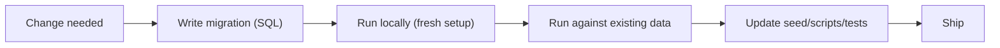

Databases aren’t static. As your app grows, your schema grows with it:

- new features need new tables/columns
- constraints get added after you understand the data better
- indexes get introduced as performance needs grow

“Just run `ALTER TABLE` in production” can be risky without a plan.

This lesson teaches how to evolve a schema safely and predictably.

---

## Why this matters (even for a learning project)

SQL Arena already evolves:

- new app schemas get added (social, ecommerce)
- new comparison rules appear (ordering requirements)
- lessons and progress tables get introduced

When schema changes aren’t organized, you get:

- broken setups for new contributors
- hard-to-reproduce bugs (“works on my machine”)
- inconsistent data (missing constraints, invalid statuses)

Migrations are the solution.

---

## What is a migration?

A migration is a **versioned, repeatable** change to the database.

Good migrations are:

- deterministic (same output every time)
- small and reviewable
- reversible when possible (or at least safe)

You can implement migrations with:

- a migration framework/tool
- or “ordered SQL files” run in sequence

The important part is the discipline, not the tool.

---

## Schema migration vs data migration

### Schema migration

Changes table structure:

- create/alter tables
- add indexes
- add constraints

### Data migration

Transforms data to match new rules:

- backfills new columns
- cleans invalid values
- normalizes formats (`''` → `NULL`)

Example (data migration):

```sql
UPDATE social_users
SET bio = NULL
WHERE bio = '';
```

---

## Common schema changes (and safe patterns)

### 1) Add a column

```sql
ALTER TABLE social_users
ADD COLUMN bio TEXT;
```

If the column must be non-null, consider a staged approach:

1) add column as nullable
2) backfill
3) add `NOT NULL`

---

### 2) Add a `CHECK` constraint (enum-like values)

Example: question difficulty.

```sql
ALTER TABLE questions
ADD CONSTRAINT chk_questions_difficulty
CHECK (difficulty IN ('easy','medium','hard'));
```

Why this is a big win:

- constraints block invalid states
- your app becomes more robust to bad seed data and scripts

---

### 3) Add a foreign key

Foreign keys protect relationships (no “orphan rows”).

```sql
ALTER TABLE user_progress
ADD CONSTRAINT fk_user_progress_user
FOREIGN KEY (user_id) REFERENCES users(id) ON DELETE CASCADE;
```

Before adding a FK on a table with existing rows, you often need:

- a cleanup step (remove invalid rows)
- or a careful backfill

---

### 4) Add an index

Indexes are the most common “performance migration”.

```sql
CREATE INDEX idx_user_progress_user
ON user_progress (user_id);
```

In production databases, creating an index can block writes. PostgreSQL supports `CREATE INDEX CONCURRENTLY` (advanced) to reduce blocking.

---

## Safe constraint additions: the beginner-friendly checklist

Before adding a constraint on an existing table:

1) **Check existing data**
2) **Fix invalid rows**
3) Add the constraint
4) Add tests/seed scripts to prevent regressions

Example: before adding a status constraint:

```sql
SELECT status, COUNT(*)
FROM user_progress
GROUP BY status
ORDER BY COUNT(*) DESC;
```

If you find invalid values, clean them before adding the `CHECK`.

---

## Migrations and transactions

Many schema changes should be run in a transaction so you don’t leave the DB half-changed:

```sql
BEGIN;

ALTER TABLE questions
ADD CONSTRAINT chk_questions_difficulty
CHECK (difficulty IN ('easy','medium','hard'));

COMMIT;
```

If a step fails, `ROLLBACK` prevents partial state.

Some operations (like `CREATE INDEX CONCURRENTLY`) cannot run inside a transaction block—that’s an advanced detail, but good to know.

---

## Real-world example: evolving comparison rules

Suppose you introduce ordering requirements for some questions.

You might do:

1) schema: add/standardize keys in `questions.comparison_config`
2) data: backfill default configs for existing questions
3) performance: add or adjust indexes if lookup patterns change

Because `comparison_config` is JSONB, you can often evolve it without schema changes—but you still want versioned migrations so everyone’s DB stays consistent.

---

## Diagram: a simple migration workflow



---

## Common mistakes (and fixes)

### Mistake 1: one huge migration

Hard to review and hard to debug.

Prefer small steps:

- add column
- backfill
- add constraint

### Mistake 2: ignoring existing data

Constraints can fail if old rows violate the rule.

Always run a quick “data audit” query first.

### Mistake 3: changing schema without updating seed/setup scripts

For open source, setup scripts are part of the product.

If setup breaks, contributors can’t run the project.

---

## Practice: check yourself

1) What’s the difference between a schema migration and a data migration?
2) Why can adding a constraint fail on an existing table?
3) What are the safe steps to add a `NOT NULL` column when the table already has rows?
4) Why are transactions useful for migrations?

---

## Summary

- Migrations are versioned, repeatable schema changes.
- Data migrations clean/backfill data to meet new rules.
- Add constraints and indexes in small, safe steps.
- Keep setup/seed scripts in sync with schema changes.
