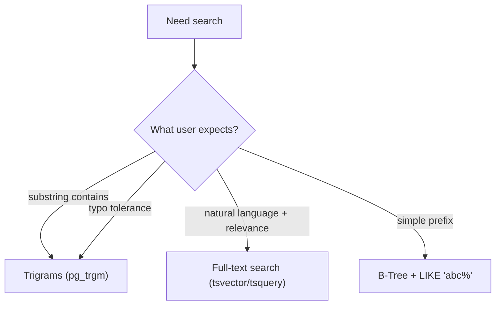

Simple pattern matching (`LIKE` / `ILIKE`) is a great start, but it has limits:

- `ILIKE '%term%'` often gets slow as tables grow
- it doesn’t rank results by relevance
- it doesn’t handle natural language well (“sql joins” vs “join sql”)

PostgreSQL gives you two powerful options for “real search”:

1) **Full‑text search** (FTS): token-based, good for relevance and language features
2) **Trigram search** (`pg_trgm`): fast substring contains + fuzzy matching

This lesson teaches when to use each, plus the basic building blocks.

---

## Start with the question: what kind of search do you need?

### A) “Contains” search (substring)

Users expect:

- searching `reddy` finds `sathyareddy`
- searching `pro` finds `MacBook Pro`

This is substring matching. Trigrams are usually the best tool.

### B) Natural language search (tokens + relevance)

Users expect:

- searching `sql join` matches “SQL joins for beginners”
- results ranked by relevance, not just “contains”

This is full-text search.

---

## Option 1: Full-text search (FTS)

Full-text search is built on two key types:

- `tsvector`: a normalized set of tokens from text
- `tsquery`: a search query over those tokens

### Basic FTS query (single column)

```sql
SELECT id, title
FROM social_posts
WHERE to_tsvector('english', title) @@ plainto_tsquery('english', 'sql join')
ORDER BY id ASC
LIMIT 20;
```

What’s happening:

- `to_tsvector` tokenizes and normalizes the `title`
- `plainto_tsquery` turns a user phrase into a query
- `@@` means “matches”

### Search across multiple columns

It’s common to search title + content together:

```sql
SELECT id, title
FROM social_posts
WHERE to_tsvector('english', COALESCE(title, '') || ' ' || COALESCE(content, ''))
  @@ plainto_tsquery('english', 'window function');
```

### Ranking results by relevance

FTS can score matches:

```sql
SELECT
  id,
  title,
  ts_rank(
    to_tsvector('english', COALESCE(title, '') || ' ' || COALESCE(content, '')),
    plainto_tsquery('english', 'sql join')
  ) AS rank
FROM social_posts
WHERE to_tsvector('english', COALESCE(title, '') || ' ' || COALESCE(content, ''))
  @@ plainto_tsquery('english', 'sql join')
ORDER BY rank DESC, id ASC
LIMIT 20;
```

Example output shape:

| id | title | rank |
|---:|---|---:|
| 114 | SQL joins explained | 0.42 |
| 91 | Learn SQL join types | 0.38 |

---

## Option 2: Trigram search (`pg_trgm`)

Trigram search breaks strings into overlapping 3-character chunks (“trigrams”) and compares similarity.

It’s especially good for:

- fast `ILIKE '%term%'`
- fuzzy matching (typos)
- ranking by “closeness”

### Basic trigram “contains” query (still uses `ILIKE`)

```sql
SELECT id, username
FROM social_users
WHERE username ILIKE '%reddy%'
ORDER BY id ASC
LIMIT 20;
```

With the right trigram index, this can be fast even on large tables.

### Similarity ranking

You can rank approximate matches:

```sql
SELECT
  id,
  username,
  similarity(username, 'sathya') AS sim
FROM social_users
WHERE username % 'sathya'
ORDER BY sim DESC, id ASC
LIMIT 20;
```

Notes:

- `%` is a trigram “similarity match” operator (provided by `pg_trgm`).
- You can adjust the similarity threshold (advanced).

---

## Indexing (what makes this fast)

### Trigrams: enable extension + create GIN index

```sql
CREATE EXTENSION IF NOT EXISTS pg_trgm;
```

```sql
CREATE INDEX idx_social_users_username_trgm
ON social_users
USING GIN (username gin_trgm_ops);
```

This supports fast “contains” matching and similarity matching on `username`.

You can do the same for product names:

```sql
CREATE INDEX idx_ecommerce_products_name_trgm
ON ecommerce_products
USING GIN (name gin_trgm_ops);
```

### Full‑text: create a GIN index on a `tsvector`

You can index a `tsvector` expression:

```sql
CREATE INDEX idx_social_posts_title_fts
ON social_posts
USING GIN (to_tsvector('english', title));
```

In real applications, you often:

- add a generated column (`search_vector`)
- index that column

That keeps queries simpler and faster.

---

## Choosing between FTS and trigrams (practical rules)

Use **trigrams** when:

- you need “contains” search (`%term%`)
- you want fuzzy matching / typo tolerance
- your input is more like identifiers (usernames, product names)

Use **FTS** when:

- you search longer text (posts, descriptions)
- you want token-based search and relevance ranking
- you care about stemming (“joins” vs “join”) and stopwords

---

## Common mistakes (and fixes)

### Mistake 1: using `ILIKE '%term%'` forever

It’s fine at small scale. When it slows down, add trigrams.

### Mistake 2: treating FTS like substring search

FTS matches tokens, not arbitrary substrings.

- FTS is great for words.
- Trigrams are great for substrings.

### Mistake 3: forgetting `COALESCE` on nullable text

Concatenating `NULL` yields `NULL`.

Use `COALESCE(content, '')` when building search documents.

---

## Diagram: choose your search tool



---

## Practice: check yourself

1) You want “username contains input” search. Which tool is a better long-term fit: FTS or trigrams? Why?
2) Write a query that searches `social_posts` by FTS over `title` and sorts by relevance.
3) Write a trigram similarity query that finds usernames similar to `'sathya'` and sorts by similarity.

---

## Summary

- Full‑text search is token-based and supports relevance ranking.
- Trigram search is great for substring contains and fuzzy matching.
- Indexes (GIN) are what make both approaches fast at scale.
