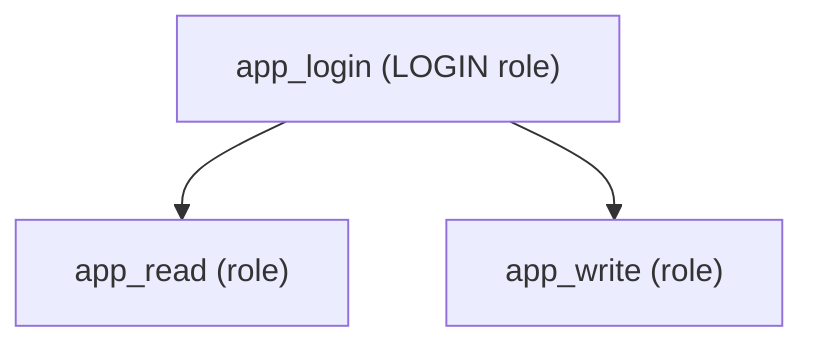
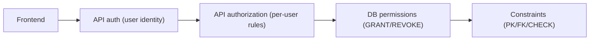

Even in open-source learning projects, security matters. In SQL Arena specifically:

- users run queries that touch real tables
- progress is stored per user
- one user’s actions should never affect another user’s data

Security is layered (“defense in depth”):

- the frontend is not trusted
- the API must authenticate and authorize
- the database must enforce permissions and constraints

This lesson focuses on PostgreSQL database security concepts:

- roles (users/groups)
- `GRANT` / `REVOKE`
- least privilege
- a gentle introduction to row-level security (RLS)

---

## The principle to remember: least privilege

**Least privilege** means:

> Give each role only the permissions it needs—no more.

Why it matters:

- if credentials leak, damage is limited
- mistakes are less destructive (“can’t drop tables by accident”)
- debugging is easier (“why can’t this query run?” has a clear answer)

---

## Roles in PostgreSQL (users and groups)

PostgreSQL uses “roles” for both:

- login users (can connect)
- groups (used to bundle permissions)

Common real-world structure:

- one “app” login role
- one “read-only” role (SELECT)
- one “writer” role (INSERT/UPDATE/DELETE)

Conceptually:



The login role inherits permissions through membership.

---

## `GRANT` and `REVOKE` (the basics)

### Grant read-only access

```sql
GRANT SELECT ON social_posts TO app_read;
```

### Grant write access

```sql
GRANT INSERT, UPDATE, DELETE ON user_progress TO app_write;
```

### Remove access

```sql
REVOKE DELETE ON user_progress FROM app_write;
```

Think of these as “capabilities you hand out”.

---

## Don’t forget sequences (PostgreSQL gotcha)

If a table uses `SERIAL`/`BIGSERIAL`, inserts may require permissions on the sequence too.

In practice, you often:

- grant on tables
- grant on sequences

This is one reason many apps keep DB roles simple (one role with all needed privileges) unless they truly need separation.

---

## Database permissions vs application authorization

Database permissions answer:

- “can this role run this SQL at all?”

Application authorization answers:

- “is this user allowed to do this action?”

In SQL Arena:

- the API authenticates the user (who are you?)
- the API restricts actions to `req.userId` (which rows can you affect?)
- the DB protects integrity with constraints (PK/FK/CHECK)

Even if your DB role can `UPDATE user_progress`, your API should still ensure:

- you only update progress for the authenticated user

---

## Row-level security (RLS): letting the database enforce “your rows only”

RLS is an advanced feature where the database enforces row access.

It can prevent:

- one user reading another user’s rows
- one user updating another user’s progress

But it adds complexity:

- you must manage policies
- you must manage how the database knows “current user id”

For many apps, API-level checks are the first step. RLS is a “level up” when you want the DB to enforce invariants too.

---

## SQL playground security (why this is hard)

If users can run arbitrary SQL, you must consider:

- **timeouts**: prevent infinite/slow queries
- **resource limits**: prevent huge sorts and joins from exhausting memory
- **statement restrictions**: many playgrounds allow only `SELECT`
- **schema boundaries**: limit which tables can be touched

In other words, it’s not just “can they select”, it’s “can they crash the system”.

That’s why SQL Arena has safeguards around execution, comparison, and timeouts.

---

## Common mistakes (and how to avoid them)

### Mistake 1: one superuser role for everything

Convenient, but risky.

If the app connects as a superuser, any SQL injection or bug becomes catastrophic.

### Mistake 2: assuming the frontend is a security boundary

The frontend can hide buttons, but it cannot enforce security.

Always enforce permissions on the API and/or DB.

### Mistake 3: forgetting constraints are also “security”

Constraints prevent invalid states:

- progress rows pointing to non-existent users (FK)
- invalid statuses (CHECK)

They reduce the chance of “security bugs” that become data corruption.

---

## Diagram: defense in depth



---

## Practice: check yourself

1) In one sentence: what does “least privilege” mean?
2) If a role has `SELECT` but not `UPDATE`, what can it do?
3) Why is “run arbitrary SQL” risky without timeouts and restrictions?
4) What’s one thing the DB can enforce (constraints) that the API might forget?

---

## Summary

- Roles control database permissions; `GRANT`/`REVOKE` hand out capabilities.
- Least privilege limits damage and reduces accidental mistakes.
- API authorization and DB permissions solve different problems; you usually want both.
- SQL playgrounds need extra guardrails: timeouts, limits, and statement restrictions.
