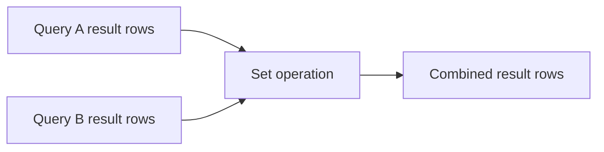

Set operations combine the results of two (or more) `SELECT` queries.

They’re useful when you want to treat query results like **sets of rows**:

- stack results on top of each other
- find overlap (in both)
- find difference (in A but not B)

In practice, set operations show up in:

- activity feeds (“likes + comments”)
- “active users” definitions (“posted OR commented”)
- deduplicating entity lists (“unique users with any interaction”)

---

## The one thing to remember

Some set operations **remove duplicates**.

This is the most common beginner bug:

- you meant to count events
- but you accidentally deduplicated them

---

## Requirements (what must match)

For any set operation, each query must return:

1) the **same number of columns**
2) compatible types in each column position

Example: both return a single `user_id` column.

```sql
SELECT user_id FROM social_likes
UNION ALL
SELECT user_id FROM social_comments;
```

---

## `UNION ALL`: stack rows (keep duplicates)

Use `UNION ALL` when each row represents an **event** and duplicates matter.

Example: likes and comments are separate events; you want to keep them all.

```sql
SELECT user_id FROM social_likes
UNION ALL
SELECT user_id FROM social_comments;
```

### Real-world example: top 5 users by total interactions

```sql
SELECT user_id, COUNT(*) AS interactions
FROM (
  SELECT user_id FROM social_likes
  UNION ALL
  SELECT user_id FROM social_comments
) t
GROUP BY user_id
ORDER BY interactions DESC, user_id ASC
LIMIT 5;
```

Why `UNION ALL` matters:

- If a user has 10 likes and 10 comments, you want `20`, not `2`.

---

## `UNION`: stack rows (deduplicate)

Use `UNION` when you want a **unique list of entities**.

Example: “users who either liked or commented at least once”.

```sql
SELECT user_id FROM social_likes
UNION
SELECT user_id FROM social_comments
ORDER BY user_id ASC;
```

Interpretation:

- if a user appears in both tables, they show up once

Example output shape:

| user_id |
|---:|
| 1 |
| 3 |
| 4 |

---

## `INTERSECT`: rows that appear in both

Use `INTERSECT` when you want “in A and in B”.

Example: “users who both liked and commented”.

```sql
SELECT user_id FROM social_likes
INTERSECT
SELECT user_id FROM social_comments
ORDER BY user_id ASC;
```

Practical note:

- `INTERSECT` deduplicates by default (like set intersection).

---

## `EXCEPT`: rows in the first query but not the second

Use `EXCEPT` for “in A but not in B”.

Example: “users who liked but never commented”.

```sql
SELECT user_id FROM social_likes
EXCEPT
SELECT user_id FROM social_comments
ORDER BY user_id ASC;
```

This is often a clean way to express “difference between two sets”.

---

## How this compares to joins

Some problems can be solved with either:

- set operations (`EXCEPT`, `INTERSECT`)
- joins/anti-joins (`NOT EXISTS`, `LEFT JOIN ... IS NULL`)

Example: “liked but never commented”.

`EXCEPT` version:

```sql
SELECT user_id FROM social_likes
EXCEPT
SELECT user_id FROM social_comments;
```

`NOT EXISTS` version (often preferred in complex queries):

```sql
SELECT DISTINCT l.user_id
FROM social_likes l
WHERE NOT EXISTS (
  SELECT 1
  FROM social_comments c
  WHERE c.user_id = l.user_id
);
```

Rule of thumb:

- `EXCEPT` is great when both sides are simple and you want a clean set difference.
- `NOT EXISTS` is more flexible when the “B” condition is more complex.

---

## Ordering rules (important)

Only the **final** result can be ordered.

If you need ordering, wrap and order outside:

```sql
SELECT user_id
FROM (
  SELECT user_id FROM social_likes
  UNION
  SELECT user_id FROM social_comments
) t
ORDER BY user_id ASC;
```

---

## Common mistakes (and how to avoid them)

### Mistake 1: using `UNION` instead of `UNION ALL`

If you’re counting events, default to `UNION ALL`.

### Mistake 2: mismatched columns

This will fail:

```sql
-- wrong: different number of columns
SELECT user_id, created_at FROM social_likes
UNION ALL
SELECT user_id FROM social_comments;
```

Fix by selecting matching columns:

```sql
SELECT user_id, created_at FROM social_likes
UNION ALL
SELECT user_id, created_at FROM social_comments;
```

### Mistake 3: confusing “unique users” with “total interactions”

- unique users: `UNION` (or `COUNT(DISTINCT user_id)`)
- total interactions: `UNION ALL` then `COUNT(*)`

---

## Diagram: mental model



---

## Practice: check yourself

1) Return a unique list of users who either **posted** or **commented**:
   - `social_posts.user_id`
   - `social_comments.user_id`
2) Return users who **commented but never liked** (swap the `EXCEPT` order).
3) Build “active users” as a unique list of users who posted, liked, or commented.
4) Build “interaction events” as a stacked list using `UNION ALL`, then count total events.

---

## Summary

- Use `UNION ALL` to stack rows without deduplication (best for events and counting).
- Use `UNION` to stack and deduplicate (best for unique entity lists).
- Use `INTERSECT` for overlap and `EXCEPT` for difference.
- Order only the final combined result.
