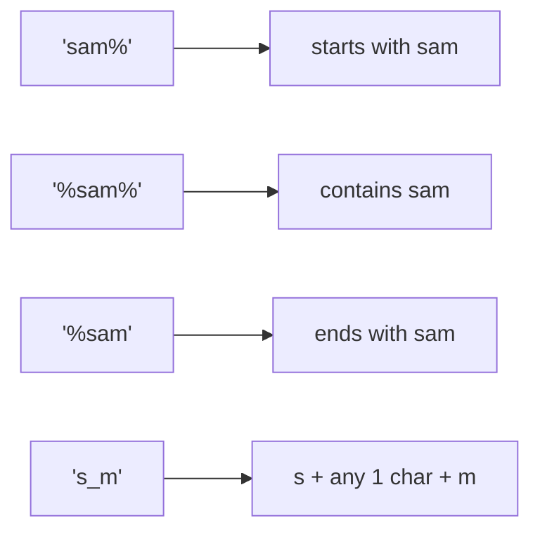

Most SQL apps eventually need “search by text”:

- find users by username
- find posts by title/content
- find products by name

The simplest tool for that is `LIKE` (and `ILIKE` in PostgreSQL).

This lesson teaches:

- how pattern matching works
- how to build a simple search box query
- common mistakes (escaping, `NULL`, and performance)

---

## What `LIKE` does (the mental model)

`LIKE` compares a text column to a pattern.

Two wildcard characters matter:

- `%` matches **any number** of characters (including zero)
- `_` matches **exactly one** character

You can think of it as “string pattern matching”, not full search.

---

## `LIKE` basics (starts with / ends with / contains)

### Starts with

```sql
SELECT id, username
FROM social_users
WHERE username LIKE 'a%';
```

### Ends with

```sql
SELECT id, username
FROM social_users
WHERE username LIKE '%bot';
```

### Contains

```sql
SELECT id, title
FROM social_posts
WHERE title LIKE '%sql%';
```

Example output shape:

| id | title |
|---:|---|
| 91 | Learn SQL joins |
| 114 | SQL tips for beginners |

---

## `_` wildcard (exactly one character)

This is useful for fixed-length patterns.

```sql
-- Matches: a1b, aXb, a_b (one character in the middle)
SELECT id, username
FROM social_users
WHERE username LIKE 'a_b';
```

---

## `ILIKE` (PostgreSQL): case-insensitive match

PostgreSQL adds `ILIKE` which is case-insensitive.

```sql
SELECT id, username
FROM social_users
WHERE username ILIKE 'sam%';
```

This matches:

- `sam...`
- `Sam...`
- `SAM...`

If you’re writing cross-database SQL, a common alternative is:

```sql
SELECT id, username
FROM social_users
WHERE LOWER(username) LIKE LOWER('sam%');
```

---

## `NULL` behavior (easy to miss)

If `content` is `NULL`, then:

```sql
content LIKE '%abc%'
```

returns `NULL` (unknown), which behaves like “false” in a `WHERE` clause.

That means `LIKE` automatically excludes `NULL` values.

If you want `NULL` to behave like an empty string, you can normalize:

```sql
WHERE COALESCE(content, '') ILIKE '%' || :q || '%'
```

---

## Escaping `%` and `_` (literal search)

If the user types `%` or `_`, your pattern becomes a wildcard pattern.

Sometimes you want “treat user input literally”.

### Simple case: search for a literal `%`

```sql
SELECT id, content
FROM social_posts
WHERE content LIKE '%\\%%';
```

### Better approach: use `ESCAPE`

PostgreSQL supports `ESCAPE` to choose an escape character explicitly.

```sql
-- Treat \% and \_ as literal % and _
SELECT id, content
FROM social_posts
WHERE content LIKE '%\\_%' ESCAPE '\\';
```

In real applications, you typically:

- escape user input in the app code
- then pass it as a parameter

---

## Real-world: building a simple “search box”

Assume the app has a search string `:q`.

### Option A: treat empty input as “show everything”

```sql
SELECT id, title, created_at
FROM social_posts
WHERE :q = ''
   OR title ILIKE '%' || :q || '%'
ORDER BY created_at DESC, id DESC
LIMIT 20;
```

Why this pattern is common:

- it avoids dynamic SQL
- it keeps one query shape

### Option B: search across multiple columns

```sql
SELECT id, title, content
FROM social_posts
WHERE :q = ''
   OR title ILIKE '%' || :q || '%'
   OR content ILIKE '%' || :q || '%'
ORDER BY created_at DESC, id DESC
LIMIT 20;
```

---

## Common mistakes (and fixes)

### Mistake 1: forgetting tie-breakers in ordering

If you sort by `created_at` only, ties can reorder.

Use:

```sql
ORDER BY created_at DESC, id DESC
```

### Mistake 2: `%term%` for everything

`'%term%'` is the easiest to write, but it’s the hardest to index (see performance note below).

If your product supports prefix search (“type-ahead”), prefer:

```sql
WHERE username ILIKE :q || '%'
```

This can be much faster with a B-Tree index.

---

## Diagram: pattern intuition



---

## Performance note (beginner-friendly, but important)

Normal B-Tree indexes can often help with:

- `LIKE 'abc%'` (prefix)

They usually cannot help much with:

- `LIKE '%abc%'` (contains)

If “contains search” becomes a core feature, PostgreSQL has great tools:

- trigram indexes (`pg_trgm`)
- full-text search (`to_tsvector`)

Those are covered in the “Search” lesson.

---

## Practice: check yourself

1) Find users whose `username` contains `'dev'` (case-insensitive).
2) Find posts whose `content` starts with `'http'` (hint: `'http%'`).
3) Find products whose name ends with `'Pro'` (case-insensitive).
4) Write a “search box” query that searches both `title` and `content`, but returns everything when `:q = ''`.

---

## Summary

- `LIKE` uses `%` and `_` wildcards.
- `ILIKE` (PostgreSQL) is case-insensitive.
- Be careful with escaping and `NULL`.
- Prefer prefix search for performance when possible.
