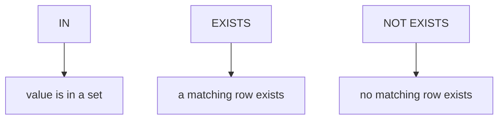

Subqueries let one query depend on the result of another query.

They are useful for questions like:

- “users who liked but never commented”
- “posts that have more likes than comments”
- “users who posted every day this week”

This lesson focuses on the most common subquery tools:

- `IN`
- `EXISTS`
- `NOT EXISTS`
- why `NOT IN` can be dangerous with `NULL`

---

## 1) `IN`: “value is in this list”

Use `IN` when you want to filter by a set of values.

### `IN` with a literal list

```sql
SELECT id, media_type
FROM social_posts
WHERE media_type IN ('video', 'image')
LIMIT 20;
```

### `IN` with a subquery

Example: users who have commented (at least once):

```sql
SELECT id, username
FROM social_users
WHERE id IN (
  SELECT DISTINCT user_id
  FROM social_comments
)
ORDER BY id ASC
LIMIT 50;
```

---

## 2) `EXISTS`: “does a matching row exist?”

`EXISTS` is often the best tool when the subquery depends on the outer row.

Example: users who have at least one post:

```sql
SELECT u.id, u.username
FROM social_users u
WHERE EXISTS (
  SELECT 1
  FROM social_posts p
  WHERE p.user_id = u.id
)
ORDER BY u.id ASC
LIMIT 50;
```

Why `SELECT 1`?

- the subquery is only checking existence
- it doesn’t matter what you select inside

---

## 3) `NOT EXISTS`: the safest “anti-join”

“A but not B” is extremely common.

Example: users who liked at least one post but never commented:

```sql
SELECT DISTINCT l.user_id
FROM social_likes l
WHERE NOT EXISTS (
  SELECT 1
  FROM social_comments c
  WHERE c.user_id = l.user_id
)
ORDER BY l.user_id ASC;
```

This is the pattern you should reach for by default.

---

## 4) `NOT IN` pitfalls (the `NULL` trap)

You might write:

```sql
SELECT DISTINCT user_id
FROM social_likes
WHERE user_id NOT IN (
  SELECT user_id
  FROM social_comments
);
```

The problem:

- if the subquery returns a `NULL`, `NOT IN` can behave unexpectedly

Why:

- SQL has three-valued logic (`TRUE` / `FALSE` / `NULL`)
- `x NOT IN (1, NULL)` becomes “unknown” for many values

Beginner rule:

> Prefer `NOT EXISTS` unless you’re sure the subquery cannot return `NULL`.

---

## 5) Correlated subqueries (subquery depends on outer row)

`EXISTS` and `NOT EXISTS` examples above are correlated:

- the subquery uses `u.id` or `l.user_id`

Correlated subqueries are powerful, but they can be slower than joins on huge datasets.

In many cases, PostgreSQL optimizes them well (especially `EXISTS` patterns).

---

## Example: posts with more likes than comments (two subqueries)

One clean approach is “pre-aggregate then compare”:

```sql
WITH likes_cte AS (
  SELECT post_id, COUNT(*) AS like_count
  FROM social_likes
  GROUP BY post_id
),
comments_cte AS (
  SELECT post_id, COUNT(*) AS comment_count
  FROM social_comments
  GROUP BY post_id
)
SELECT l.post_id
FROM likes_cte l
LEFT JOIN comments_cte c ON c.post_id = l.post_id
WHERE l.like_count > COALESCE(c.comment_count, 0)
ORDER BY l.post_id ASC;
```

This avoids join multiplication and keeps the comparison correct.

---

## Common mistakes (and fixes)

### Mistake 1: using `NOT IN` with nullable subquery output

Fix: use `NOT EXISTS`.

### Mistake 2: using `IN` where you need correlation

If the inner query depends on the outer row, `EXISTS` is usually clearer.

### Mistake 3: forgetting `DISTINCT` when selecting from an event table

If you select `user_id` from `social_likes`, you’ll get multiple rows per user.

If you want unique users, add `DISTINCT` or use `GROUP BY`.

---

## Diagram: set membership vs existence



---

## Practice: check yourself

1) Find users who have commented at least once (use `IN`).
2) Find users who have posted at least once (use `EXISTS`).
3) Find users who liked but never commented (use `NOT EXISTS`).
4) Explain in one sentence why `NOT IN` can be dangerous.

---

## Summary

- `IN` is great for membership in a set of values.
- `EXISTS` is great for correlated “does a match exist?” checks.
- `NOT EXISTS` is the safest anti-join pattern.
- `NOT IN` can break if the subquery returns `NULL`.
