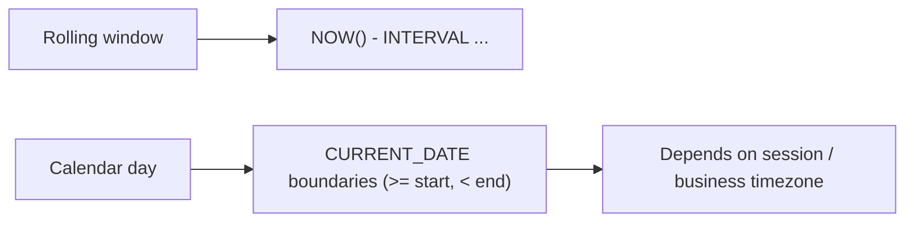

Date/time bugs are some of the most common issues in real SQL work:

- numbers look “off by one day”
- “today” queries change depending on where you run them
- reports shift when daylight saving time changes

This lesson is PostgreSQL-focused and teaches the practical rules that keep your queries predictable.

---

## What you should remember (the 3 rules)

1) **Store event timestamps as `timestamptz`** (an absolute moment in time).
2) **Decide what time zone “today” means** (user time zone vs app time zone vs database time zone).
3) For filters, prefer **range predicates** (`>=` and `<`) over `DATE(created_at) = ...` (more correct and more index-friendly).

---

## `timestamp` vs `timestamptz` (in plain language)

In PostgreSQL:

- `timestamp` (without time zone) is just a calendar date/time value like `2026-04-01 10:00:00` with **no timezone meaning**
- `timestamptz` (timestamp with time zone) represents a **specific instant** (stored in UTC internally; displayed in a session time zone)

### Rule of thumb

- Use `timestamptz` for events: `created_at` for posts, likes, submissions, payments.
- Use `timestamp` only for “wall-clock” values that are not an instant (rare in typical event tables).

Why this matters:

- events happen at an instant
- “today” and “yesterday” depend on time zone

---

## Where the time zone comes from

PostgreSQL has a concept of a **session time zone**. That can come from:

- database settings
- the client connection settings
- your application setting it explicitly

When you write:

```sql
CURRENT_DATE
```

you get “today” according to the session time zone.

If your app has users worldwide, using the database time zone blindly can be wrong for user-facing “today” metrics.

---

## “Today” queries: calendar day vs rolling window

These are different questions:

### A) “last 24 hours” (rolling window)

```sql
SELECT COUNT(*) AS recent_posts
FROM social_posts
WHERE created_at >= NOW() - INTERVAL '24 hours';
```

This means:

- from this exact moment back 24 hours
- not aligned to midnight

### B) “today” (calendar day boundary)

```sql
SELECT COUNT(*) AS likes_today
FROM social_likes
WHERE created_at >= CURRENT_DATE
  AND created_at < CURRENT_DATE + INTERVAL '1 day';
```

This means:

- from midnight at the start of today (in the session time zone)
- up to (but not including) midnight tomorrow

---

## Why `DATE(created_at) = CURRENT_DATE` is risky

You’ll see this pattern:

```sql
SELECT COUNT(*) AS likes_today
FROM social_likes
WHERE DATE(created_at) = CURRENT_DATE;
```

It’s readable, but has two practical issues:

1) **Time zone ambiguity**: `DATE(created_at)` depends on how `created_at` is interpreted and on the session time zone.
2) **Performance**: applying a function to the column often prevents index usage.

Prefer the sargable range version instead (same logic, fewer surprises).

---

## Picking a “business time zone”

Many products define a single “business timezone” (for dashboards), for example:

- all daily metrics are computed in `UTC`
- or all daily metrics are computed in `America/Los_Angeles`

If you do that, write it down in the product, and make “today” queries consistent with it.

At the query level, you’ll typically:

- convert timestamps into that time zone
- compute boundaries in that time zone

### Example: “today” in a fixed time zone (conceptual)

Suppose you want “today in Asia/Kolkata”.

The idea is:

- compute start and end instants for “today in Asia/Kolkata”
- then filter `created_at` by that range

```sql
-- Conceptual pattern: compute day boundaries then filter by a range
WHERE created_at >= (CURRENT_DATE::timestamp AT TIME ZONE 'Asia/Kolkata')
  AND created_at < ((CURRENT_DATE + 1)::timestamp AT TIME ZONE 'Asia/Kolkata')
```

Important:

- The exact expression you want depends on the type of `created_at` and your session timezone.
- The *principle* is the key: compute day boundaries in the business timezone, then filter by an absolute range.

---

## Common pitfalls (and how to avoid them)

### Pitfall 1: assuming `NOW()` is UTC

`NOW()` returns a `timestamptz` value (an instant). The display can be in a timezone, but the instant is correct.

The danger is mixing it with `timestamp` values or “today” boundaries incorrectly.

### Pitfall 2: mixing `timestamp` and `timestamptz`

If your schema has a mix, be explicit about conversions.

### Pitfall 3: daylight saving time boundaries

In DST zones, some days have 23 or 25 hours.

If you do “today” boundaries with `CURRENT_DATE + INTERVAL '1 day'`, you’re describing calendar days correctly.

If you do “last 24 hours”, you’re describing a rolling window correctly.

They’re different questions—pick the one that matches the requirement.

---

## Real-world examples using project tables

### 1) Likes created “today” (calendar day)

```sql
SELECT COUNT(*) AS likes_today
FROM social_likes
WHERE created_at >= CURRENT_DATE
  AND created_at < CURRENT_DATE + INTERVAL '1 day';
```

### 2) Posts created in the last 7 calendar days (including today)

```sql
SELECT COUNT(*) AS posts_7d
FROM social_posts
WHERE created_at >= CURRENT_DATE - INTERVAL '6 days'
  AND created_at < CURRENT_DATE + INTERVAL '1 day';
```

This is a calendar-day window (7 calendar days).

### 3) Average daily signups in the last 30 days (calendar days)

```sql
SELECT ROUND(AVG(user_count), 2) AS avg_daily_signups
FROM (
  SELECT DATE(created_at) AS day, COUNT(*) AS user_count
  FROM social_users
  WHERE created_at >= CURRENT_DATE - INTERVAL '29 days'
    AND created_at < CURRENT_DATE + INTERVAL '1 day'
  GROUP BY DATE(created_at)
) t;
```

---

## Diagram: calendar boundaries vs rolling windows



---

## Check yourself

1) Which is correct for “posts created in the last 24 hours”: `NOW()` or `CURRENT_DATE`? Why?
2) Rewrite `DATE(created_at) = CURRENT_DATE` into a range filter using `>=` and `<`.
3) In one sentence: why can “today” differ for India vs California?

---

## Summary

- `timestamptz` represents an instant; `timestamp` does not.
- “today” is a calendar concept and depends on a time zone.
- Prefer range filters for correctness and performance.
