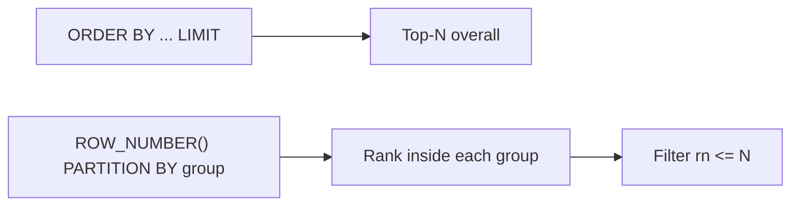

“Top N” queries are easy:

```sql
SELECT *
FROM ecommerce_products
ORDER BY price DESC
LIMIT 10;
```

But “Top N **per group**” is the tricky one:

- the latest post **per user**
- the most expensive product **per category**
- the top 3 most commented posts **per day**

The core trap:

> `ORDER BY ... LIMIT` only limits the whole query, not each group.

This lesson teaches the reliable, beginner-friendly pattern to solve it.

---

## Why it matters

Top‑per‑group queries show up constantly in real apps:

- “show each user’s latest activity”
- “show each product’s latest review”
- “show top sellers per category”

Once you understand the pattern, a lot of “hard SQL” problems become repeatable.

---

## The reliable pattern: `ROW_NUMBER()` + `PARTITION BY`

The general solution is:

1) compute a ranking inside each group using a window function
2) filter to the first N ranks

Template:

```sql
SELECT *
FROM (
  SELECT
    ...,
    ROW_NUMBER() OVER (
      PARTITION BY group_key
      ORDER BY sort_key DESC, tie_breaker DESC
    ) AS rn
  FROM source_rows
) t
WHERE rn <= N;
```

Two important ideas:

- `PARTITION BY` defines the groups.
- `ORDER BY` inside the window defines “best” within each group.

---

## Example 1: most recent post per user

Goal: return **one post per `user_id`**, choosing the newest.

```sql
SELECT user_id, id AS post_id, created_at
FROM (
  SELECT
    p.user_id,
    p.id,
    p.created_at,
    ROW_NUMBER() OVER (
      PARTITION BY p.user_id
      ORDER BY p.created_at DESC, p.id DESC
    ) AS rn
  FROM social_posts p
) t
WHERE rn = 1
ORDER BY user_id ASC;
```

Why the tie-breaker matters:

- If two posts have the same `created_at`, the `id` tie-breaker ensures stable results.

Example output shape:

| user_id | post_id | created_at |
|---:|---:|---|
| 1 | 991 | 2026-03-31 18:02:11 |
| 2 | 431 | 2026-03-28 09:44:03 |

---

## Example 2: top 2 most expensive products per category

Goal: for each category, return the two highest-priced products.

```sql
SELECT category_id, id AS product_id, price
FROM (
  SELECT
    p.category_id,
    p.id,
    p.price,
    ROW_NUMBER() OVER (
      PARTITION BY p.category_id
      ORDER BY p.price DESC, p.id ASC
    ) AS rn
  FROM ecommerce_products p
) t
WHERE rn <= 2
ORDER BY category_id ASC, price DESC, product_id ASC;
```

Notes:

- We tie-break by `id ASC` so equal prices are stable.
- The final `ORDER BY` just makes the output readable.

---

## Example 3: top 3 most commented posts today

First compute comment counts, then rank them.

```sql
WITH counts AS (
  SELECT post_id, COUNT(*) AS comment_count
  FROM social_comments
  WHERE created_at >= CURRENT_DATE
    AND created_at < CURRENT_DATE + INTERVAL '1 day'
  GROUP BY post_id
)
SELECT post_id, comment_count
FROM (
  SELECT
    post_id,
    comment_count,
    ROW_NUMBER() OVER (
      ORDER BY comment_count DESC, post_id ASC
    ) AS rn
  FROM counts
) t
WHERE rn <= 3
ORDER BY comment_count DESC, post_id ASC;
```

This pattern matches “order requirements” questions:

- primary sort: `comment_count DESC`
- tie-break: `post_id ASC`

---

## Two other approaches (good to know)

### Option A: `DISTINCT ON` (PostgreSQL-only)

`DISTINCT ON (group_key)` keeps the **first** row per group.

```sql
SELECT DISTINCT ON (user_id)
  user_id, id AS post_id, created_at
FROM social_posts
ORDER BY user_id, created_at DESC, id DESC;
```

Rules:

- You must order by the group key first (`ORDER BY user_id, ...`).
- The remaining order defines which row is “first”.

This is concise and fast in PostgreSQL, but not portable.

### Option B: `LATERAL` with `LIMIT` (PostgreSQL-only)

When you want “one child row per parent row”, `LATERAL` can be very readable:

```sql
SELECT
  u.id AS user_id,
  p.id AS latest_post_id,
  p.created_at
FROM social_users u
LEFT JOIN LATERAL (
  SELECT id, created_at
  FROM social_posts p
  WHERE p.user_id = u.id
  ORDER BY created_at DESC, id DESC
  LIMIT 1
) p ON true;
```

---

## Common mistakes (and fixes)

### Mistake 1: using global `LIMIT` instead of per-group ranking

This returns only 10 rows total (not 10 per category):

```sql
SELECT category_id, id, price
FROM ecommerce_products
ORDER BY price DESC
LIMIT 10;
```

Fix: rank per category with `ROW_NUMBER() ... PARTITION BY category_id`.

### Mistake 2: forgetting tie-breakers

Without tie-breakers, results can flip between equal values.

Always choose deterministic ordering:

- `created_at DESC, id DESC`
- `count DESC, id ASC`

### Mistake 3: sorting after filtering instead of ranking correctly

The ranking must happen before you filter to `rn <= N`.

---

## Diagram: global top‑N vs per‑group top‑N



---

## Practice: check yourself

1) Return the most recent like per `user_id` from `social_likes` (one row per user).
2) Return the top 2 products by price per `category_id` from `ecommerce_products`.
3) For each day, return the single post with the most comments (hint: `PARTITION BY day` where `day = DATE(created_at)`).
4) Rewrite “latest post per user” using `DISTINCT ON`.

---

## Summary

- Use `ROW_NUMBER() OVER (PARTITION BY ... ORDER BY ...)` to rank within groups.
- Filter by `rn` to get top 1 / top N per group.
- Add deterministic tie-breakers to avoid flaky results.
- PostgreSQL alternatives (`DISTINCT ON`, `LATERAL`) can be concise but are less portable.
