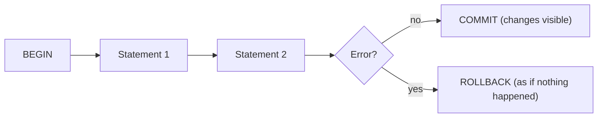

Transactions let you bundle multiple SQL statements into one **all-or-nothing** unit.

That matters any time you do multi-step work, such as:

- insert a submission *and* update progress
- create a user *and* initialize progress rows
- reset an app by deleting rows in multiple tables

Without transactions, you can end up with “half applied” state.

This lesson teaches the practical transaction skills you’ll use constantly.

---

## What a transaction guarantees (in simple terms)

A transaction gives you:

- **Atomicity**: either all statements succeed, or none do.
- **Consistency**: constraints stay true (PK/FK/CHECK).
- **Isolation**: concurrent transactions don’t corrupt each other.
- **Durability**: once committed, data persists.

You don’t need to memorize the acronym, but you should remember the promise:

> Transactions prevent partial writes and keep your data consistent.

---

## The basic shape

```sql
BEGIN;

-- step 1
-- step 2
-- step 3

COMMIT;
```

If anything goes wrong:

```sql
ROLLBACK;
```

Nothing is applied.

---

## Autocommit (what happens if you don’t use `BEGIN`)

Most clients run in “autocommit” mode:

- each statement is its own transaction

That means this is **not** atomic across both statements:

```sql
INSERT INTO user_submissions (...) VALUES (...);
UPDATE user_progress SET ... WHERE ...;
```

If the first succeeds and the second fails, your system state is inconsistent.

If you want both statements to succeed or fail together, you must use a transaction.

---

## Example: record submission + update progress (atomic)

Imagine a “submit answer” action needs to:

1) insert a row into `user_submissions`
2) update `user_progress` (`attempts_count`, `status`, etc.)

Use a transaction:

```sql
BEGIN;

INSERT INTO user_submissions (user_id, question_id, status, query, created_at)
VALUES (1, 123, 'attempted', 'SELECT ...', NOW());

UPDATE user_progress
SET attempts_count = attempts_count + 1,
    status = 'attempted',
    updated_at = NOW()
WHERE user_id = 1 AND question_id = 123;

COMMIT;
```

If the update fails (missing progress row, invalid status, FK issue), you want the submission insert to roll back too.

---

## Why reset scripts often use transactions

Reset scripts delete related rows from multiple tables:

- delete child rows (submissions, progress, hints, etc.)
- delete parent rows (questions, apps, schemas, …)

If you only run half and crash, the database can be left in a weird state.

Wrapping reset logic in one transaction prevents partial resets.

---

## Locking (the practical intuition)

When a transaction writes, it takes locks.

Locks prevent other transactions from seeing or creating conflicting changes.

Two common behaviors:

### Blocking

One transaction waits for another to finish.

This is normal and often correct.

### Deadlocks

Two transactions each wait on the other.

PostgreSQL detects this and aborts one transaction to break the cycle.

You typically solve deadlocks by:

- updating tables in a consistent order
- keeping transactions short

---

## Isolation levels (keep it beginner-friendly)

PostgreSQL default isolation level is **READ COMMITTED**.

Practical meaning:

- you only see data that other transactions have committed
- if you run the same query again inside your transaction, you might see newer committed data (your snapshot is not fixed)

This is usually the best choice for app backends.

Other isolation levels exist (like `REPEATABLE READ`), but you can treat them as advanced until you need them.

---

## Savepoints (optional tool, but useful)

Sometimes you want to partially roll back inside a transaction without aborting everything.

That’s what savepoints are for:

```sql
BEGIN;

SAVEPOINT step1;

-- try something risky
-- if it fails, you can roll back to the savepoint:
ROLLBACK TO SAVEPOINT step1;

COMMIT;
```

Most beginner workflows don’t need this, but it’s good to know the concept exists.

---

## Diagram: all-or-nothing boundary



---

## Common mistakes (and fixes)

### Mistake 1: transactions that are too long

Long transactions:

- hold locks longer
- can block others
- can produce more dead tuples

Fix:

- keep transactions short
- do only necessary work inside them

### Mistake 2: mixing reads and writes without thinking about consistency

If you read a row, then later update it, another transaction may have changed it in between.

In many cases, that’s fine. When it isn’t, you might need:

- stronger isolation
- or explicit locking (`SELECT ... FOR UPDATE`) (advanced)

### Mistake 3: assuming constraints replace transactions

Constraints prevent invalid states, but transactions prevent partial multi-step writes.

You usually need both.

---

## Practice: check yourself

1) What bug happens if you insert a submission but fail to update `user_progress`?
2) Why is it safer to reset an app inside one transaction?
3) In one sentence: what does “READ COMMITTED” mean?
4) What’s a deadlock, and how does PostgreSQL handle it?

---

## Summary

- Transactions group statements into an all-or-nothing unit.
- Use `BEGIN`/`COMMIT` to ensure multi-step writes stay consistent.
- Locks are normal; keep transactions short to reduce blocking.
- Default isolation (`READ COMMITTED`) is usually right for app backends.
