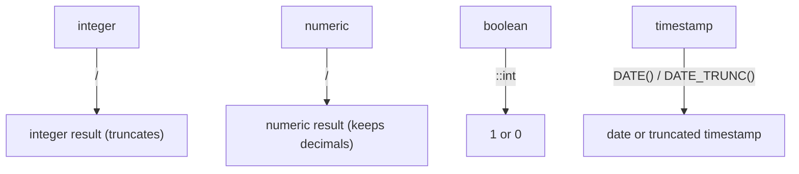

SQL is strongly typed:

- integers behave differently from decimals
- booleans behave differently from text
- timestamps behave differently from dates

Many “mysterious” analytics bugs are really type bugs:

- percentages become `0` unexpectedly
- division crashes when the denominator is `0`
- rounding looks inconsistent
- comparisons fail because one side is text and the other is numeric

This lesson teaches the most common type pitfalls and the patterns that keep results correct.

---

## Why it matters (in SQL Arena)

Many challenges and dashboard-style queries involve:

- ratios and percentages (verified users %)
- averages (average comments per post, average likes per day)
- rounding to 2 decimals
- time-based grouping (`DATE(created_at)`)

If you understand types, you avoid silent wrong answers.

---

## The most common bug: integer division

In many databases, dividing integers yields an integer.

```sql
SELECT 1 / 2 AS half;
```

What you might expect: `0.5`  
What you might get: `0`

### Fix 1: cast to `numeric`

```sql
SELECT 1::numeric / 2 AS half;
```

### Fix 2: use a decimal literal

```sql
SELECT 1.0 / 2 AS half;
```

Beginner rule:

> If you want decimals, make at least one side decimal.

---

## Casting in PostgreSQL (two styles)

PostgreSQL supports:

- `value::type` (Postgres shorthand)
- `CAST(value AS type)` (portable SQL)

```sql
SELECT
  42::text AS as_text,
  CAST(42 AS text) AS also_text;
```

Common casts you’ll use:

- `::numeric` (for safe division)
- `::int` (rarely needed, but useful)
- `::boolean` (when reading text flags)
- `::date` (when converting timestamps)

---

## Percentages done correctly (types + rounding)

Example: “verified users percentage” from `social_users`.

```sql
SELECT ROUND(
  100.0 * COUNT(*) FILTER (WHERE is_verified = true) / COUNT(*),
  2
) AS verified_percentage
FROM social_users;
```

Why this works:

- `COUNT(*)` returns an integer
- multiplying by `100.0` forces a decimal calculation
- `ROUND(..., 2)` formats the final output

Example output shape:

| verified_percentage |
|---:|
| 12.34 |

---

## Safe division (avoid divide-by-zero)

If the denominator can be zero, you must protect the division.

### Pattern 1: `NULLIF(denominator, 0)` (clean and common)

```sql
SELECT
  total / NULLIF(count, 0) AS avg_value
FROM (
  SELECT SUM(amount) AS total, COUNT(*) AS count
  FROM ecommerce_payments
) t;
```

If `count = 0`, `NULLIF(count, 0)` becomes `NULL`, so the result becomes `NULL` instead of erroring.

When to use:

- you want “no data” to show up as missing (`NULL`)

### Pattern 2: `CASE WHEN` (explicit fallback)

```sql
SELECT
  CASE
    WHEN count = 0 THEN 0
    ELSE total / count
  END AS avg_value
FROM (
  SELECT SUM(amount) AS total, COUNT(*) AS count
  FROM ecommerce_payments
) t;
```

When to use:

- you want `0` instead of `NULL`
- your UI expects an explicit number

---

## Rounding: round at the right step

`ROUND` is most predictable with `numeric`:

```sql
SELECT ROUND(12.3456::numeric, 2) AS rounded;
```

Output:

| rounded |
|---:|
| 12.35 |

### Don’t round too early

If you round each line item before summing, totals can drift.

Prefer:

1) compute using full precision
2) round at the end for display

Example:

```sql
SELECT
  order_id,
  ROUND(SUM(quantity * unit_price), 2) AS order_total
FROM ecommerce_order_items
GROUP BY order_id
ORDER BY order_total DESC, order_id ASC
LIMIT 10;
```

---

## Numeric precision (quick intuition)

Ecommerce tables often use:

- `price NUMERIC(10, 2)`

That’s a decimal with 2 digits after the decimal point.

It’s ideal for money because it avoids floating point rounding surprises.

---

## Booleans as numbers (PostgreSQL trick)

PostgreSQL supports:

- `true::int` → `1`
- `false::int` → `0`

That lets you compute boolean percentages very neatly:

```sql
SELECT ROUND(AVG(is_verified::int) * 100, 2) AS verified_percentage
FROM social_users;
```

Why it works:

- averaging 1s and 0s yields the fraction that are `true`

---

## Dates vs timestamps (types affect filtering)

Most event columns are timestamps (`created_at`).

If you cast a timestamp to date:

```sql
DATE(created_at)
```

you:

- lose time information
- may make the filter less index-friendly

For “today” filters, prefer range predicates:

```sql
WHERE created_at >= CURRENT_DATE
  AND created_at < CURRENT_DATE + INTERVAL '1 day'
```

---

## Diagram: how types influence operators



---

## Real-world examples (SQL Arena style)

### Example 1: average comments per commented post (safe)

```sql
SELECT ROUND(
  COUNT(*)::numeric / NULLIF(COUNT(DISTINCT post_id), 0),
  2
) AS avg_comments
FROM social_comments;
```

### Example 2: average likes per day (rolling window example)

```sql
SELECT ROUND(AVG(likes_per_day), 2) AS avg_likes_per_day
FROM (
  SELECT DATE(created_at) AS day, COUNT(*) AS likes_per_day
  FROM social_likes
  WHERE created_at >= CURRENT_DATE - INTERVAL '29 days'
    AND created_at < CURRENT_DATE + INTERVAL '1 day'
  GROUP BY DATE(created_at)
) t;
```

### Example 3: percentage of posts with location

```sql
SELECT ROUND(
  100.0 * COUNT(*) FILTER (WHERE location IS NOT NULL) / COUNT(*),
  2
) AS pct_posts_with_location
FROM social_posts;
```

---

## Common mistakes (and fixes)

### Mistake 1: dividing two integers

Fix: cast to `numeric` or use decimal literals.

### Mistake 2: divide-by-zero in ratio metrics

Fix: `NULLIF(denominator, 0)` or `CASE WHEN`.

### Mistake 3: rounding too early

Fix: round at the final output stage.

---

## Practice: check yourself

1) Return `1 / 3` as `0.33` (two decimals).
2) Compute “likes per commented post” as:
   - numerator: total likes
   - denominator: distinct posts with comments
   Make it safe for divide-by-zero.
3) Write a query that returns:
   - `verified_percentage`
   - `unverified_percentage`
   Both rounded to 2 decimals.

---

## Summary

- Types affect correctness: integer division and rounding are common traps.
- Cast to `numeric` (or use decimal literals) for ratios and percentages.
- Use `NULLIF(..., 0)` to make division safe.
- Prefer range filters for timestamps instead of casting to date.
