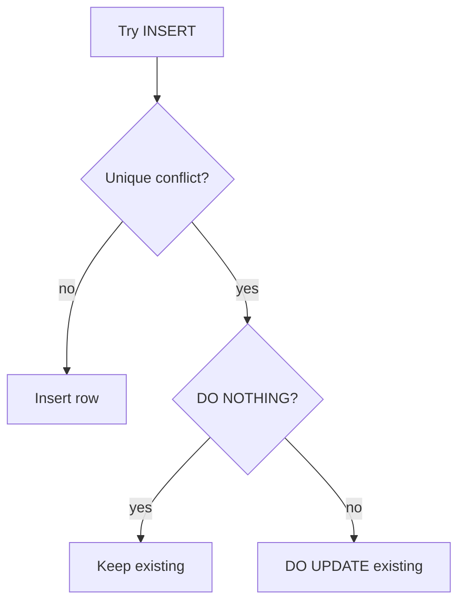

An **upsert** means:

- insert a row if it doesn’t exist
- otherwise update the existing row

Upserts are the backbone of **idempotent writes**:

- running the same request twice doesn’t create duplicates
- progress tables stay “one row per user per thing”

In SQL Arena, upserts are especially useful for:

- `user_progress` (one row per user + question)
- `user_lesson_progress` (one row per user + lesson)
- “settings” tables keyed by user id

This lesson teaches the practical patterns and the most common mistakes.

---

## Why it matters

Without upserts, backend code often does:

1) `SELECT` to see if a row exists
2) `INSERT` if missing, else `UPDATE`

That approach has problems:

- race conditions under concurrency (two requests insert at the same time)
- more round trips (slower)
- more code paths to maintain

Upserts move that logic into one safe statement.

---

## The prerequisite: a unique constraint

`ON CONFLICT` needs a conflict target:

- a unique index
- or a unique constraint

Example: `user_progress` has uniqueness on `(user_id, question_id)`.

That means:

- there can be only one progress row for a given user and question

---

## The basic pattern

```sql
INSERT INTO user_progress (user_id, question_id, status, attempts_count, updated_at)
VALUES (1, 123, 'attempted', 1, NOW())
ON CONFLICT (user_id, question_id)
DO UPDATE SET
  status = EXCLUDED.status,
  attempts_count = user_progress.attempts_count + 1,
  updated_at = NOW();
```

Key idea:

- `EXCLUDED` is the row you tried to insert (the “incoming” row).

---

## `DO NOTHING`: insert if missing, otherwise ignore

This is useful for seeding stable dimension tables.

Example: concepts are unique by name:

```sql
INSERT INTO concepts (name)
VALUES ('joins')
ON CONFLICT (name) DO NOTHING;
```

Now running the seed twice won’t create duplicates.

---

## Real-world: progress upsert for lessons

When a user marks a lesson as in progress, you want:

- create the row if missing
- update status if it exists

```sql
INSERT INTO user_lesson_progress (user_id, lesson_id, status, updated_at)
SELECT 1, id, 'in_progress', NOW()
FROM lessons
WHERE slug = 'select-basics'
ON CONFLICT (user_id, lesson_id)
DO UPDATE SET
  status = EXCLUDED.status,
  updated_at = NOW();
```

Why `INSERT ... SELECT` is nice:

- you can look up `lesson_id` inside the statement
- you avoid “select id in app code, then insert” round trips

---

## Returning values from an upsert

PostgreSQL supports `RETURNING` with upserts.

Example:

```sql
INSERT INTO user_progress (user_id, question_id, status, attempts_count, updated_at)
VALUES (1, 123, 'attempted', 1, NOW())
ON CONFLICT (user_id, question_id)
DO UPDATE SET
  status = EXCLUDED.status,
  attempts_count = user_progress.attempts_count + 1,
  updated_at = NOW()
RETURNING user_id, question_id, status, attempts_count;
```

This is perfect for APIs: you get the latest state back in one statement.

---

## Conditional updates (skip updates when nothing changed)

Sometimes you only want to update if something is different.

Example: don’t rewrite the row if the status is already the same:

```sql
INSERT INTO user_progress (user_id, question_id, status, updated_at)
VALUES (1, 123, 'attempted', NOW())
ON CONFLICT (user_id, question_id)
DO UPDATE SET
  status = EXCLUDED.status,
  updated_at = NOW()
WHERE user_progress.status IS DISTINCT FROM EXCLUDED.status;
```

Why it helps:

- avoids pointless writes
- avoids updating timestamps when nothing changed

---

## Conflict targets: choosing the right one

You can target:

- columns: `ON CONFLICT (col1, col2)`
- constraint name: `ON CONFLICT ON CONSTRAINT constraint_name`

Column targets are most common in small projects.

Constraint targets can be helpful when:

- the unique constraint is complex
- you want to explicitly reference the named constraint

---

## Common pitfalls (and how to avoid them)

### Pitfall 1: no unique constraint exists

No unique constraint → no conflict target → you can’t use `ON CONFLICT` meaningfully.

Fix: add the unique constraint that matches your real “one row per …” rule.

### Pitfall 2: wrong conflict target corrupts data

If your uniqueness is `(user_id, question_id)` but you upsert on `(question_id)`:

- user 1 can overwrite user 2’s progress

Fix: upsert using the correct natural key.

### Pitfall 3: incrementing counters incorrectly

If you set:

```sql
attempts_count = EXCLUDED.attempts_count
```

you might reset the counter.

If you want to increment, reference the existing row:

```sql
attempts_count = user_progress.attempts_count + 1
```

---

## Diagram: upsert flow



---

## Practice: check yourself

1) Write an upsert for `users(username)` that inserts a user or does nothing if it exists.
2) Write an upsert for `user_progress(user_id, question_id)` that:
   - inserts status `'attempted'` if missing
   - otherwise increments `attempts_count`
3) Add `RETURNING` to return the updated `attempts_count`.
4) Add a conditional update that only changes status when it differs.

---

## Summary

- Upserts make “insert or update” logic safe and fast.
- They require a unique constraint that matches your data model.
- `EXCLUDED` represents the incoming row; reference the existing table row for increments.
- `RETURNING` makes upserts perfect for APIs.
