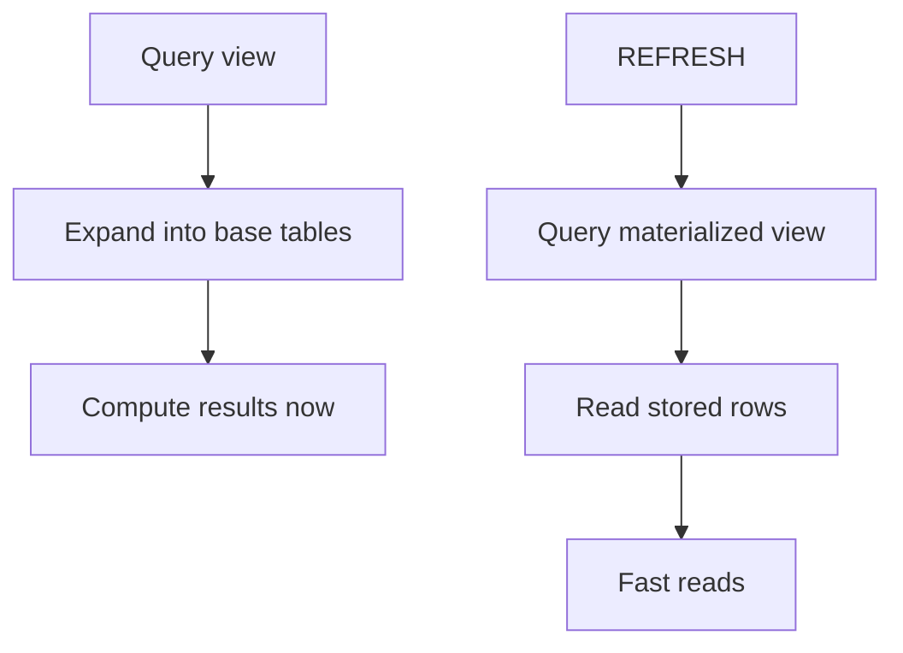

As your project grows, you’ll write queries you want to reuse:

- “top users by interactions”
- “daily signup counts”
- “posts with likes/comments counts”

Copy-pasting those queries into every report is messy and error-prone.

Views let you give a query a name so other queries can build on it like a table.

PostgreSQL supports two flavors:

- **view**: stores the query definition (computed at query time)
- **materialized view**: stores the result rows (computed when refreshed)

This lesson teaches what each is, when to use them, and the common beginner pitfalls.

---

## Why it matters

Views help you:

- keep metric definitions consistent (“interactions” means the same everywhere)
- simplify complex queries (readability)
- build dashboards without rewriting the same logic

Materialized views help you:

- make expensive aggregates fast
- build stable reporting tables for “daily metrics”

---

## 1) View: a reusable named query

A view is basically “a named `SELECT`”.

### Example: per-post like counts

```sql
CREATE VIEW social_like_counts AS
SELECT post_id, COUNT(*) AS like_count
FROM social_likes
GROUP BY post_id;
```

Now you can query it like a table:

```sql
SELECT
  p.id AS post_id,
  COALESCE(l.like_count, 0) AS like_count
FROM social_posts p
LEFT JOIN social_like_counts l ON l.post_id = p.id
ORDER BY p.id ASC
LIMIT 20;
```

Example output shape:

| post_id | like_count |
|---:|---:|
| 1 | 0 |
| 2 | 5 |

---

## What a view does (important)

When you query a view, PostgreSQL expands it into the underlying query.

So a view is mostly for:

- readability
- reuse
- consistency

It is not automatically faster.

---

## Views as “definitions of truth”

If your app defines “interactions” as:

- likes + comments

You can create a view that encodes that definition:

```sql
CREATE VIEW social_interaction_rows AS
SELECT user_id, created_at, 'like'::text AS kind
FROM social_likes
UNION ALL
SELECT user_id, created_at, 'comment'::text AS kind
FROM social_comments;
```

Now every report can build on the same base definition:

```sql
SELECT user_id, COUNT(*) AS interactions
FROM social_interaction_rows
GROUP BY user_id
ORDER BY interactions DESC, user_id ASC
LIMIT 10;
```

---

## Can views be updated?

Some simple views can be “updatable” (Postgres can route updates to the underlying table).

But many views are not updatable:

- views with aggregates
- views with joins
- views with `UNION ALL`

In most analytics/reporting usage, treat views as read-only.

---

## 2) Materialized view: cached results

A materialized view stores the result rows.

That can be much faster for heavy aggregates.

### Example: daily signups

```sql
CREATE MATERIALIZED VIEW social_daily_signups AS
SELECT DATE(created_at) AS day, COUNT(*) AS user_count
FROM social_users
GROUP BY DATE(created_at);
```

Querying is fast:

```sql
SELECT *
FROM social_daily_signups
ORDER BY day DESC
LIMIT 30;
```

But the results can become stale. You must refresh:

```sql
REFRESH MATERIALIZED VIEW social_daily_signups;
```

---

## Refresh strategies (what you should know)

### Manual refresh

You run `REFRESH MATERIALIZED VIEW ...` when you want updated numbers.

### Scheduled refresh (typical in production)

Many systems refresh materialized views:

- every minute
- hourly
- nightly

depending on freshness needs.

### Concurrent refresh (advanced)

PostgreSQL supports `REFRESH MATERIALIZED VIEW CONCURRENTLY` in some cases to reduce blocking, but it has requirements (like unique indexes). Treat this as advanced unless you need it.

---

## Indexing materialized views

Materialized views can be indexed like tables:

```sql
CREATE INDEX ON social_daily_signups (day);
```

This makes “last 30 days” queries very fast.

---

## When to use which (practical rules)

Use a **view** when:

- you want a reusable definition of a metric/query
- you need always-live results
- performance is acceptable

Use a **materialized view** when:

- the underlying query is expensive
- you query it frequently (dashboards)
- you can tolerate results being slightly stale

---

## Common mistakes (and how to avoid them)

### Mistake 1: assuming a view “stores data”

A normal view does not store results. It stores a definition.

If the base tables change, the view result changes immediately (because it re-runs).

### Mistake 2: forgetting to refresh a materialized view

If you don’t refresh, the numbers are old.

Always decide:

- how fresh the data must be
- when refresh should happen

### Mistake 3: building views that hide performance issues

Views can make queries look simpler, but they don’t remove work.

Use `EXPLAIN`/`EXPLAIN ANALYZE` on the view query if performance matters.

---

## Diagram: view vs materialized view



---

## Practice: check yourself

1) Create a view that returns per-user comment counts from `social_comments`.
2) Create a materialized view for daily post counts from `social_posts`.
3) In one sentence: why aren’t materialized views always used?
4) What’s the most common “stale data” mistake with materialized views?

---

## Summary

- Views store query definitions; they improve reuse and consistency.
- Materialized views store results; they improve speed for repeated heavy aggregates.
- Materialized views must be refreshed; views are always live.
